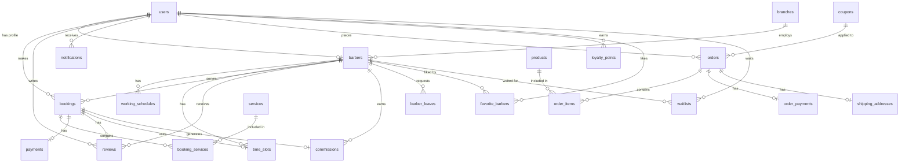

# 🗄 Database Schema — Classic Cut

## ERD (Entity Relationship)

## Bảng chi tiết

### `users`
| Cột | Kiểu | Mô tả |
|-----|------|-------|
| id | bigint PK | |
| name | varchar | Tên người dùng |
| email | varchar UNIQUE | |
| phone | varchar NULL | Số điện thoại |
| avatar | varchar NULL | Đường dẫn ảnh đại diện |
| role | enum(admin, barber, customer) | Vai trò |
| is_active | boolean DEFAULT true | Trạng thái hoạt động |
| password | varchar | Mật khẩu (hashed) |
| timestamps | | created_at, updated_at |

### `barbers`
| Cột | Kiểu | Mô tả |
|-----|------|-------|
| id | bigint PK | |
| user_id | FK → users | Liên kết tài khoản |
| bio | text NULL | Giới thiệu |
| experience_years | int DEFAULT 0 | Số năm kinh nghiệm |
| rating | decimal(3,2) DEFAULT 0 | Rating trung bình |
| commission_rate | decimal(5,2) DEFAULT 0 | % hoa hồng riêng cho thợ |
| is_active | boolean DEFAULT true | Đang hoạt động |
| branch_id | FK → branches NULL | Chi nhánh trực thuộc |
| timestamps | | |

### `services`
| Cột | Kiểu | Mô tả |
|-----|------|-------|
| id | bigint PK | |
| name | varchar | Tên dịch vụ |
| description | text NULL | Mô tả |
| price | decimal(10,2) | Giá (VNĐ) |
| duration | int | Thời lượng (phút) |
| image | varchar NULL | Ảnh minh hoạ |
| is_active | boolean DEFAULT true | |
| timestamps | | |

### `working_schedules`
| Cột | Kiểu | Mô tả |
|-----|------|-------|
| id | bigint PK | |
| barber_id | FK → barbers | |
| day_of_week | tinyint (0-6) | 0=CN, 1=T2, ..., 6=T7 |
| start_time | time | Giờ bắt đầu |
| end_time | time | Giờ kết thúc |
| is_off | boolean DEFAULT false | Ngày nghỉ |
| UNIQUE | (barber_id, day_of_week) | |

### `time_slots`
| Cột | Kiểu | Mô tả |
|-----|------|-------|
| id | bigint PK | |
| barber_id | FK → barbers | |
| slot_date | date | Ngày |
| start_time | time | Giờ bắt đầu slot |
| end_time | time | Giờ kết thúc slot |
| status | enum(available, booked) | Trạng thái |
| UNIQUE | (barber_id, slot_date, start_time) | Chống duplicate |
| INDEX | (barber_id, slot_date, status) | Tối ưu query |

### `bookings`
| Cột | Kiểu | Mô tả |
|-----|------|-------|
| id | bigint PK | |
| booking_code | varchar UNIQUE | Mã đặt lịch (BB-YYYYMMDD-XXXX) |
| user_id | FK → users | Khách hàng |
| barber_id | FK → barbers | Thợ cắt |
| time_slot_id | FK → time_slots | Slot giờ |
| booking_date | date | Ngày hẹn |
| start_time | time | Giờ bắt đầu |
| total_price | decimal(10,2) | Tổng tiền |
| total_duration | int | Tổng thời lượng (phút) |
| status | enum(pending, confirmed, in_progress, completed, cancelled) | |
| note | text NULL | Ghi chú khách hàng |
| cancel_reason | text NULL | Lý do huỷ |
| cancelled_at | timestamp NULL | Thời điểm huỷ |
| timestamps | | |

### `booking_services` (Pivot)
| Cột | Kiểu | Mô tả |
|-----|------|-------|
| booking_id | FK → bookings | |
| service_id | FK → services | |
| price_snapshot | decimal(10,2) | Giá tại thời điểm đặt |
| duration_snapshot | int | Thời lượng tại thời điểm đặt |

### `payments`
| Cột | Kiểu | Mô tả |
|-----|------|-------|
| id | bigint PK | |
| booking_id | FK → bookings UNIQUE | 1 booking = 1 payment |
| amount | decimal(10,2) | Số tiền |
| method | enum(cash, vnpay, momo) | Phương thức |
| status | enum(pending, paid, failed, refunded) | Trạng thái |
| transaction_id | varchar NULL | Mã giao dịch từ gateway |
| paid_at | timestamp NULL | Thời điểm thanh toán |
| timestamps | | |

### `reviews`
| Cột | Kiểu | Mô tả |
|-----|------|-------|
| id | bigint PK | |
| booking_id | FK → bookings UNIQUE | 1 booking = 1 review |
| user_id | FK → users | Người đánh giá |
| barber_id | FK → barbers | Thợ được đánh giá |
| rating | tinyint (1-5) | Số sao |
| comment | text NULL | Nhận xét |
| timestamps | | |

### `notifications`
| Cột | Kiểu | Mô tả |
|-----|------|-------|
| id | bigint PK | |
| user_id | FK → users | Người nhận |
| type | varchar | Loại thông báo |
| title | varchar | Tiêu đề |
| message | text | Nội dung |
| is_read | boolean DEFAULT false | Đã đọc |
| timestamps | | |

### `products`
| Cột | Kiểu | Mô tả |
|-----|------|-------|
| id | bigint PK | |
| name | varchar | Tên sản phẩm |
| description | text NULL | Mô tả chi tiết |
| price | decimal(10,2) | Giá bán |
| stock | int DEFAULT 0 | Tồn kho |
| is_active | boolean DEFAULT true | Hiển thị/Ẩn |
| featured_image | varchar NULL | Ảnh đại diện |
| timestamps | | |

### `orders`
| Cột | Kiểu | Mô tả |
|-----|------|-------|
| id | bigint PK | |
| user_id | FK → users | Khách mua hàng |
| order_code | varchar UNIQUE | Mã đơn hàng (BB-ORD-XXXX) |
| total_amount | decimal(10,2) | Tổng tiền sản phẩm |
| shipping_fee | decimal(10,2) | Phí ship (tính bằng Haversine) |
| final_amount | decimal(10,2) | Tổng thanh toán sau giảm giá |
| coupon_id | FK → coupons NULL | Mã giảm giá áp dụng |
| status | enum(pending, processing, shipped, delivered, cancelled) | Trạng thái đơn |
| product_coupon_code | varchar NULL | Mã giảm giá sản phẩm đã áp dụng |
| product_discount | decimal(12,2) DEFAULT 0 | Số tiền giảm sản phẩm |
| shipping_coupon_code | varchar NULL | Mã giảm phí ship đã áp dụng |
| shipping_discount | decimal(12,2) DEFAULT 0 | Số tiền giảm phí ship |
| timestamps | | |

### `order_items`
| Cột | Kiểu | Mô tả |
|-----|------|-------|
| id | bigint PK | |
| order_id | FK → orders | |
| product_id | FK → products | |
| quantity | int | Số lượng mua |
| price | decimal(10,2) | Giá tại thời điểm mua |
| timestamps | | |

### `coupons`
| Cột | Kiểu | Mô tả |
|-----|------|-------|
| id | bigint PK | |
| code | varchar UNIQUE | Mã Coupon (VD: SALE10) |
| type | enum(fixed, percent) | Loại giảm giá |
| applies_to | string DEFAULT 'product' | Phạm vi: product, shipping, booking |
| value | decimal(10,2) | Mức giảm |
| min_order_amount | decimal(10,2) | Đơn tối thiểu để áp dụng |
| max_discount_amount | decimal(10,2) | Giảm tối đa (nếu %)|
| limit | int | Giới hạn số lần dùng |
| used | int | Số lần đã dùng |
| expires_at | datetime NULL | Hạn sử dụng |
| is_active | boolean DEFAULT true | |
| timestamps | | |

### `shipping_addresses`
| Cột | Kiểu | Mô tả |
|-----|------|-------|
| id | bigint PK | |
| order_id | FK → orders UNIQUE | 1 đơn = 1 địa chỉ |
| province | varchar | Tỉnh/Thành |
| district | varchar | Quận/Huyện |
| ward | varchar | Phường/Xã |
| address_detail | varchar | Địa chỉ chi tiết |
| phone | varchar | SĐT nhận hàng |
| timestamps | | |

### `order_payments`
| Cột | Kiểu | Mô tả |
|-----|------|-------|
| id | bigint PK | |
| order_id | FK → orders UNIQUE | 1 đơn = 1 payment |
| amount | decimal(10,2) | Số tiền |
| method | string (cod, vnpay, momo) | Phương thức |
| status | string DEFAULT 'pending' | pending, paid, failed |
| transaction_id | varchar NULL | Mã giao dịch từ gateway |
| paid_at | timestamp NULL | Thời điểm thanh toán |
| timestamps | | |

### `branches`
| Cột | Kiểu | Mô tả |
|-----|------|-------|
| id | bigint PK | |
| name | varchar | Tên chi nhánh |
| address | varchar | Địa chỉ |
| phone | varchar(20) NULL | Số điện thoại |
| image | varchar NULL | Ảnh chi nhánh |
| description | text NULL | Mô tả |
| is_active | boolean DEFAULT true | Đang hoạt động |
| timestamps | | |

### `commissions`
| Cột | Kiểu | Mô tả |
|-----|------|-------|
| id | bigint PK | |
| barber_id | FK → barbers | Thợ nhận hoa hồng |
| booking_id | FK → bookings UNIQUE | 1 booking = 1 lần tính |
| booking_amount | decimal(12,2) | Tổng giá trị booking |
| commission_rate | decimal(5,2) | Tỷ lệ % tại thời điểm tính |
| commission_amount | decimal(12,2) | Số tiền hoa hồng |
| note | varchar NULL | Ghi chú |
| timestamps | | |

### `barber_leaves`
| Cột | Kiểu | Mô tả |
|-----|------|-------|
| id | bigint PK | |
| barber_id | FK → barbers | |
| leave_date | date | Ngày xin nghỉ |
| type | enum(full_day, partial) | Nghỉ cả ngày / một phần |
| start_time | time NULL | Giờ bắt đầu (nếu partial) |
| end_time | time NULL | Giờ kết thúc (nếu partial) |
| reason | varchar NULL | Lý do |
| status | enum(pending, approved, rejected) | Trạng thái duyệt |
| admin_note | text NULL | Ghi chú của admin |
| reviewed_by | FK → users NULL | Admin duyệt |
| reviewed_at | timestamp NULL | Thời điểm duyệt |
| timestamps | | |
| UNIQUE | (barber_id, leave_date) | Mỗi thợ chỉ 1 đơn/ngày |

### `loyalty_points`
| Cột | Kiểu | Mô tả |
|-----|------|-------|
| id | bigint PK | |
| user_id | FK → users | Khách hàng |
| points | int | Dương = cộng, Âm = trừ |
| type | string | earn / spend |
| description | string | Mô tả giao dịch |
| related_type | varchar NULL | Polymorphic: Booking/Coupon |
| related_id | bigint NULL | Polymorphic ID |
| timestamps | | |
| INDEX | (user_id, created_at) | Tối ưu query lịch sử |

### `favorite_barbers`
| Cột | Kiểu | Mô tả |
|-----|------|-------|
| id | bigint PK | |
| user_id | FK → users | Khách hàng |
| barber_id | FK → barbers | Thợ yêu thích |
| timestamps | | |
| UNIQUE | (user_id, barber_id) | Không trùng lặp |

### `waitlists`
| Cột | Kiểu | Mô tả |
|-----|------|-------|
| id | bigint PK | |
| user_id | FK → users | Khách chờ |
| barber_id | FK → barbers | Thợ mong muốn |
| desired_date | date | Ngày mong muốn |
| desired_time | time NULL | Giờ (NULL = bất kỳ) |
| status | string DEFAULT 'waiting' | waiting, notified, expired |
| notified_at | timestamp NULL | Thời điểm thông báo |
| timestamps | | |
| INDEX | (barber_id, desired_date, status) | Tối ưu query |
