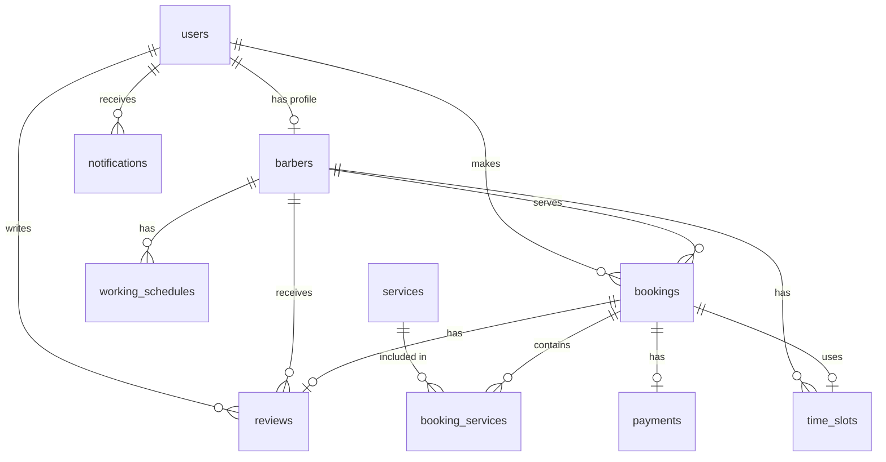

# 🗄 Database Schema — Classic Cut

## ERD (Entity Relationship)

## Bảng chi tiết

### `users`
| Cột | Kiểu | Mô tả |
|-----|------|-------|
| id | bigint PK | |
| name | varchar | Tên người dùng |
| email | varchar UNIQUE | |
| phone | varchar NULL | Số điện thoại |
| avatar | varchar NULL | Đường dẫn ảnh đại diện |
| role | enum(admin, barber, customer) | Vai trò |
| is_active | boolean DEFAULT true | Trạng thái hoạt động |
| password | varchar | Mật khẩu (hashed) |
| timestamps | | created_at, updated_at |

### `barbers`
| Cột | Kiểu | Mô tả |
|-----|------|-------|
| id | bigint PK | |
| user_id | FK → users | Liên kết tài khoản |
| bio | text NULL | Giới thiệu |
| experience_years | int DEFAULT 0 | Số năm kinh nghiệm |
| rating | decimal(3,2) DEFAULT 0 | Rating trung bình |
| is_active | boolean DEFAULT true | Đang hoạt động |
| timestamps | | |

### `services`
| Cột | Kiểu | Mô tả |
|-----|------|-------|
| id | bigint PK | |
| name | varchar | Tên dịch vụ |
| description | text NULL | Mô tả |
| price | decimal(10,2) | Giá (VNĐ) |
| duration | int | Thời lượng (phút) |
| image | varchar NULL | Ảnh minh hoạ |
| is_active | boolean DEFAULT true | |
| timestamps | | |

### `working_schedules`
| Cột | Kiểu | Mô tả |
|-----|------|-------|
| id | bigint PK | |
| barber_id | FK → barbers | |
| day_of_week | tinyint (0-6) | 0=CN, 1=T2, ..., 6=T7 |
| start_time | time | Giờ bắt đầu |
| end_time | time | Giờ kết thúc |
| is_off | boolean DEFAULT false | Ngày nghỉ |
| UNIQUE | (barber_id, day_of_week) | |

### `time_slots`
| Cột | Kiểu | Mô tả |
|-----|------|-------|
| id | bigint PK | |
| barber_id | FK → barbers | |
| slot_date | date | Ngày |
| start_time | time | Giờ bắt đầu slot |
| end_time | time | Giờ kết thúc slot |
| status | enum(available, booked) | Trạng thái |
| UNIQUE | (barber_id, slot_date, start_time) | Chống duplicate |
| INDEX | (barber_id, slot_date, status) | Tối ưu query |

### `bookings`
| Cột | Kiểu | Mô tả |
|-----|------|-------|
| id | bigint PK | |
| booking_code | varchar UNIQUE | Mã đặt lịch (BB-YYYYMMDD-XXXX) |
| user_id | FK → users | Khách hàng |
| barber_id | FK → barbers | Thợ cắt |
| time_slot_id | FK → time_slots | Slot giờ |
| booking_date | date | Ngày hẹn |
| start_time | time | Giờ bắt đầu |
| total_price | decimal(10,2) | Tổng tiền |
| total_duration | int | Tổng thời lượng (phút) |
| status | enum(pending, confirmed, in_progress, completed, cancelled) | |
| note | text NULL | Ghi chú khách hàng |
| cancel_reason | text NULL | Lý do huỷ |
| cancelled_at | timestamp NULL | Thời điểm huỷ |
| timestamps | | |

### `booking_services` (Pivot)
| Cột | Kiểu | Mô tả |
|-----|------|-------|
| booking_id | FK → bookings | |
| service_id | FK → services | |
| price_snapshot | decimal(10,2) | Giá tại thời điểm đặt |
| duration_snapshot | int | Thời lượng tại thời điểm đặt |

### `payments`
| Cột | Kiểu | Mô tả |
|-----|------|-------|
| id | bigint PK | |
| booking_id | FK → bookings UNIQUE | 1 booking = 1 payment |
| amount | decimal(10,2) | Số tiền |
| method | enum(cash, vnpay, momo) | Phương thức |
| status | enum(pending, paid, failed, refunded) | Trạng thái |
| transaction_id | varchar NULL | Mã giao dịch từ gateway |
| paid_at | timestamp NULL | Thời điểm thanh toán |
| timestamps | | |

### `reviews`
| Cột | Kiểu | Mô tả |
|-----|------|-------|
| id | bigint PK | |
| booking_id | FK → bookings UNIQUE | 1 booking = 1 review |
| user_id | FK → users | Người đánh giá |
| barber_id | FK → barbers | Thợ được đánh giá |
| rating | tinyint (1-5) | Số sao |
| comment | text NULL | Nhận xét |
| timestamps | | |

### `notifications`
| Cột | Kiểu | Mô tả |
|-----|------|-------|
| id | bigint PK | |
| user_id | FK → users | Người nhận |
| type | varchar | Loại thông báo |
| title | varchar | Tiêu đề |
| message | text | Nội dung |
| is_read | boolean DEFAULT false | Đã đọc |
| timestamps | | |
