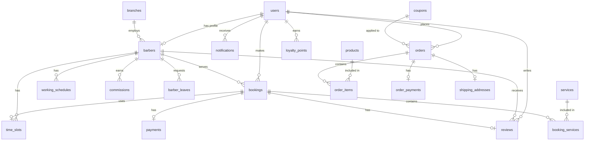

# 📖 Classic Cut Barbershop — Sach Giao Khoa Lap Trinh

> **Cuon sach nay khong phai tai lieu liet ke tinh nang.**
> Day la cuon cam nang dao tao danh cho lap trinh vien, giai thich **TAI SAO** moi quyet dinh ky thuat duoc dua ra,
> **VAN DE GI** se xay ra neu khong lam, va **CACH** source code thuc te dang giai quyet no.
>
> Moi khai niem deu duoc mo xe theo khung tu duy: **WHAT** (La gi?) → **WHY** (Tai sao phai dung?) → **HOW** (Dang ap dung ra sao trong code?)

---

## Muc luc

1. [Tong quan kien truc](#1-tong-quan-kien-truc)
2. [Cau truc thu muc & Duong di file](#2-cau-truc-thu-muc--duong-di-file)
3. [Luong xu ly mot Request — Tu A den Z](#3-luong-xu-ly-mot-request--tu-a-den-z)
4. [He thong Enum — Ky luat Gia tri Co dinh](#4-he-thong-enum--ky-luat-gia-tri-co-dinh)
5. [FSM (Finite State Machine) — Canh sat Trang thai](#5-fsm-finite-state-machine--canh-sat-trang-thai)
6. [DTO (Data Transfer Object) — Hop van chuyen Du lieu](#6-dto-data-transfer-object--hop-van-chuyen-du-lieu)
7. [FormRequest — Hai quan soi chieu Du lieu](#7-formrequest--hai-quan-soi-chieu-du-lieu)
8. [Service Layer — Nao bo Nghiep vu](#8-service-layer--nao-bo-nghiep-vu)
9. [Pessimistic Locking — Chong Race Condition](#9-pessimistic-locking--chong-race-condition)
10. [Luong dat lich (Booking Flow)](#10-luong-dat-lich-booking-flow)
11. [Luong thanh toan (Payment Flow)](#11-luong-thanh-toan-payment-flow)
12. [Event / Listener / Job — He thong Side Effects](#12-event--listener--job--he-thong-side-effects)
13. [Caching — CacheService](#13-caching--cacheservice)
14. [Middleware — Bo loc Request](#14-middleware--bo-loc-request)
15. [Policy — Phan quyen Row-Level](#15-policy--phan-quyen-row-level)
16. [E-Commerce — Module Ban hang](#16-e-commerce--module-ban-hang)
17. [Shipping — Tinh phi van chuyen (Haversine)](#17-shipping--tinh-phi-van-chuyen-haversine)
18. [Console Commands — Tac vu nen](#18-console-commands--tac-vu-nen)
19. [Database Schema — So do CSDL](#19-database-schema--so-do-co-so-du-lieu)
20. [Analytics & Heatmaps (ApexCharts)](#20-analytics--heatmaps-apexcharts)
21. [Bao mat nang cao — 6 Tang Phong thu](#21-bao-mat-nang-cao--6-tang-phong-thu)
22. [Nghiep vu mo rong — Loyalty, Coupon, Recurring, Waitlist](#22-nghiep-vu-mo-rong)
23. [Tong ket kien truc & Cong thuc them tinh nang moi](#23-tong-ket-kien-truc--cong-thuc-them-tinh-nang-moi)

---

## 1. Tong quan kien truc

### 🎯 WHAT — Kien truc tong the la gi?

Classic Cut su dung mo hinh **MVC + Service Layer + DTO** — mot kien truc phan tang ro rang, noi moi thanh phan chi lam DUY NHAT mot nhiem vu.

```
Request → Middleware → FormRequest → Controller → DTO → Service → Model/DB
                                                          ↘ Event → Listener → Job (side effects)
                                                          ↘ Cache (toi uu hieu suat)
```

### ❓ WHY — Tai sao phai phan tang nhu vay?

**Pain Point:** Tuong tuong ban xay mot tiem cat toc ma chi co 1 nguoi lam tat ca: don khach, kiem tra lich, cat toc, tinh tien, ghi so. Mot minh lam het thi nhanh bi qua tai, lam sai, va khong the nho nguoi khac giup vi chi minh hieu cach lam.

Trong code cung vay. Neu nhoi het logic vao Controller, no se phinh to thanh "Fat Controller" 1000 dong — kho doc, kho test, kho tai su dung.

### 🛠 HOW — Phan chia trach nhiem nhu the nao?

| Tang | Trach nhiem | **KHONG** duoc lam |
|------|------------|-------------------|
| **Controller** | Nhan request, tao DTO, goi Service, tra response | Chua business logic, query DB truc tiep |
| **FormRequest** | Validate du lieu dau vao | Chua logic nghiep vu |
| **DTO** | Dong goi du lieu, dam bao type-safe | Chua logic xu ly |
| **Service** | Business logic, DB transactions, phat Events | Tra response HTTP, nhan Request object |
| **Model** | Relationships, casts, scopes, fillable | Chua business logic phuc tap |
| **Event/Listener/Job** | Side effects (notification, email, log) | Chua core business logic |
| **Policy** | Phan quyen tren tung record cu the | Chua logic nghiep vu |
| **Middleware** | Loc request o ranh gioi (auth, role, headers) | Chua logic tinh toan |

> 🎯 **Quy tac vang:** Moi tang chi lam DUNG viec cua minh. Controller khong tinh toan. Service khong biet HTTP la gi. Model khong biet business rule.

---

## 2. Cau truc thu muc & Duong di file

```
app/
├── Console/Commands/          # Artisan commands (cron jobs)
│   ├── CleanupLogs.php        # Don log cu
│   ├── ExpireBookings.php     # Tu dong huy booking qua han
│   ├── GenerateTimeSlots.php  # Tao time slots hang ngay
│   └── SecurityAudit.php      # Kiem tra bao mat
│
├── DTOs/                      # Data Transfer Objects
│   ├── CreateBookingData.php  # Du lieu tao booking
│   ├── CreateBarberData.php   # Du lieu tao barber
│   ├── UpdateBarberData.php   # Du lieu sua barber
│   ├── CreateOrderData.php    # Du lieu tao don hang E-commerce
│   ├── StoreReviewData.php    # Du lieu danh gia
│   ├── ScheduleItemData.php   # 1 ngay trong lich
│   └── UpdateScheduleData.php # Cap nhat lich (7 ngay)
│
├── Enums/                     # Gia tri co dinh (PHP 8.1 Backed Enums)
│   ├── BookingStatus.php      # Trang thai booking (voi FSM)
│   ├── OrderStatus.php        # Trang thai don hang (voi FSM)
│   ├── PaymentMethod.php      # Phuong thuc thanh toan
│   ├── PaymentStatus.php      # Trang thai thanh toan
│   ├── TimeSlotStatus.php     # Trang thai khung gio
│   ├── UserRole.php           # Vai tro nguoi dung
│   ├── CouponType.php         # Loai giam gia (fixed/percent)
│   ├── CouponAppliesTo.php    # Ap dung cho (product/shipping/booking)
│   ├── ProductCategory.php    # Danh muc san pham
│   └── OrderPaymentMethod.php # Phuong thuc thanh toan E-commerce
│
├── Events/                    # Su kien domain
│   ├── BookingConfirmed.php
│   ├── BookingCancelled.php
│   └── BookingCompleted.php
│
├── Exceptions/
│   └── SlotNotAvailableException.php  # Slot da bi dat
│
├── Http/
│   ├── Controllers/
│   │   ├── Admin/             # 10+ controllers cho admin
│   │   ├── Barber/            # 3 controllers cho barber
│   │   └── Client/            # 8+ controllers cho khach
│   ├── Middleware/
│   │   ├── RoleMiddleware.php      # Kiem tra vai tro
│   │   ├── LogActivity.php         # Log thay doi du lieu
│   │   └── SecurityHeaders.php     # HTTP security headers
│   └── Requests/              # Form validation
│       ├── Admin/
│       ├── Barber/
│       └── Client/
│
├── Jobs/
│   └── SendBookingNotificationJob.php  # Gui notification async
│
├── Listeners/                 # Xu ly events
│   ├── SendBookingConfirmedNotification.php
│   ├── SendBookingCancelledNotification.php
│   ├── SendBookingCompletedNotification.php
│   ├── CalculateCommissionOnCompleted.php
│   ├── RewardPointsForBooking.php
│   └── NotifyWaitlistOnCancel.php
│
├── Models/                    # 21 Eloquent models
│   ├── User, Barber, Service, Booking, BookingService (pivot)
│   ├── TimeSlot, WorkingSchedule, Payment, Review, Notification
│   ├── Product, Order, OrderItem, OrderPayment, ShippingAddress
│   ├── Coupon, Branch, BarberLeave, Commission, LoyaltyPoint
│   └── Waitlist
│
├── Policies/
│   └── BookingPolicy.php      # Phan quyen booking (confirm/reject/start/complete/cancel)
│
├── Providers/
│   └── AppServiceProvider.php # Dang ky events, rate limiting
│
├── Traits/
│   └── PaymentGatewayTrait.php # Logic chung VNPay/MoMo cho Booking + Order
│
└── Services/                  # 14 business services
    ├── BookingService.php     # Tao/huy booking, FSM transitions, pessimistic locking
    ├── PaymentService.php     # VNPay + MoMo integration, signature verify
    ├── OrderService.php       # E-commerce: tao don, tru kho, tinh thue
    ├── OrderPaymentService.php # Thanh toan don hang (VNPay/MoMo/COD)
    ├── CartService.php        # Gio hang (Session-based)
    ├── ProductService.php     # CRUD san pham + tru/hoan kho an toan
    ├── ShippingService.php    # Tinh phi ship (Haversine / Google Maps fallback)
    ├── CouponService.php      # Validate + ap dung ma giam gia
    ├── TimeSlotService.php    # Sinh slot tu dong, batch upsert
    ├── ScheduleService.php    # CRUD lich lam viec barber
    ├── BarberService.php      # CRUD barber + user
    ├── ServiceService.php     # CRUD dich vu
    ├── ReviewService.php      # Danh gia + cap nhat rating trung binh
    ├── ReportService.php      # Chart.js, ApexCharts Heatmaps, Top stats
    ├── CacheService.php       # Cache layer tap trung
    └── CommissionService.php  # Tinh toan hoa hong tho cat

routes/
├── web.php                    # Routes client + guest + E-commerce
├── admin.php                  # Routes admin (prefix /admin)
├── barber.php                 # Routes barber (prefix /barber)
├── auth.php                   # Routes dang nhap/dang ky (Breeze)
└── console.php                # Cron schedules
```

---

## 3. Luong xu ly mot Request — Tu A den Z

Hay theo chan mot request thuc te: **Khach hang dat lich cat toc**.

### Buoc 1: Request bay tu browser

```
POST /booking  →  routes/web.php  →  Route::post('/booking', [BookingController::class, 'store'])
```

### Buoc 2: Middleware chan cua

```
1. SecurityHeaders    → Them header bao mat vao response (chong XSS, Clickjacking)
2. throttle:5,1       → Rate limit: toi da 5 request/phut (chong spam bot)
3. LogActivity        → Ghi log POST request (ai, lam gi, luc nao, tu IP nao)
```

### Buoc 3: FormRequest validate du lieu

```php
// File: app/Http/Requests/Client/StoreBookingRequest.php
class StoreBookingRequest extends FormRequest
{
    public function rules(): array
    {
        return [
            'service_ids'   => 'required|array|min:1',           // Phai chon it nhat 1 dich vu
            'service_ids.*' => 'exists:services,id',             // Moi service phai ton tai trong DB
            'barber_id'     => 'required|exists:barbers,id',     // Tho phai ton tai
            'time_slot_id'  => 'required|exists:time_slots,id',  // Slot phai ton tai
            'note'          => 'nullable|string|max:500',
        ];
    }
}
```

> Neu validate **fail** → Laravel tu redirect ve trang truoc + show loi. Controller KHONG BAO GIO nhan data sai.

### Buoc 4: Controller nhan request → Tao DTO → Goi Service

```php
// File: app/Http/Controllers/Client/BookingController.php
public function store(StoreBookingRequest $request)
{
    // 1. Tao DTO tu request (da validated)
    $dto = CreateBookingData::fromRequest($request);

    // 2. Goi service voi DTO — Controller KHONG tinh toan gi ca
    $booking = $this->bookingService->create($dto, $request->user());

    // 3. Redirect sang trang thanh toan
    return redirect()->route('client.payment.show', $booking);
}
```

### Buoc 5: Service xu ly business logic

```php
// File: app/Services/BookingService.php
public function create(CreateBookingData $data, ?User $customer = null): Booking
{
    return DB::transaction(function () use ($data, $customer) {
        // 1. Lock slot de tranh race condition (2 nguoi dat cung slot)
        $slot = TimeSlot::lockForUpdate()->findOrFail($data->time_slot_id);

        // 2. Kiem tra slot con available khong
        if ($slot->status !== TimeSlotStatus::Available) {
            throw new SlotNotAvailableException('Slot da duoc dat');
        }

        // 3. Tao booking + attach services + update slot
        $booking = Booking::create([...]);
        $booking->services()->attach([...]); // pivot: price_snapshot, duration_snapshot
        $slot->update(['status' => TimeSlotStatus::Booked]);

        // 4. Gui notification cho barber (async qua Job)
        SendBookingNotificationJob::dispatch($booking->barber_id, $message);

        return $booking;
    });
}
```

### So do tong quat

```
Browser POST /booking
    │
    ▼
┌─────────────────┐
│   Middleware     │  SecurityHeaders → throttle:5,1 → LogActivity
└────────┬────────┘
         │
         ▼
┌─────────────────┐
│  FormRequest    │  StoreBookingRequest → validate du lieu
│  (Validation)   │  Fail? → redirect back + loi
└────────┬────────┘
         │ (validated data)
         ▼
┌─────────────────┐
│   Controller    │  BookingController::store()
│  (Dieu phoi)    │  1. Tao DTO ← CreateBookingData::fromRequest()
│                 │  2. Goi Service ← bookingService->create()
└────────┬────────┘
         │ (DTO)
         ▼
┌─────────────────┐
│    Service      │  BookingService::create()
│ (Business Logic)│  DB::transaction → lock slot → tao booking → attach services
│                 │  → update slot status → dispatch Job → return Booking
└────────┬────────┘
         │
         ▼
┌─────────────────┐
│  Model / DB     │  Booking::create(), TimeSlot::update(), ...
└─────────────────┘
```

---

## 4. He thong Enum — Ky luat Gia tri Co dinh

### 🎯 WHAT — Enum la gi?

Enum (Enumeration) = **tap hop cac gia tri co dinh duoc dat ten**. Thay vi viet string `'pending'`, `'confirmed'` rai rac khap 50+ file code, ta goi chung vao mot class Enum duy nhat.

### ❓ WHY — Tai sao can Enum? Noi dau o day la gi?

**Pain Point:** Tuong tuong he thong KHONG co Enum:

```php
// Lap trinh vien A viet:
$booking->status = 'pending';

// Lap trinh vien B go nham chinh ta:
$booking->status = 'pendding';  // ← SAI chinh ta!

// MySQL van hon nhien luu chu "pendding"
// Man hinh Admin lay danh sach don "pending" se bi SOT don nay
// He thong gay luong ngam ma TEST CUC KHO RA
```

**Giai quyet:** Enum ep buoc tai Compile-time. IDE bao loi gach dit do lom ngay tuc thi neu ban go sai ten trang thai:

```php
$booking->status = BookingStatus::Pendding;  // ← IDE gach do: "Pendding" khong ton tai!
$booking->status = BookingStatus::Pending;   // ← ✅ Dung, an toan 100%
```

### 🛠 HOW — Cach dung trong du an

#### BookingStatus — Trang thai booking

```php
// File: app/Enums/BookingStatus.php
enum BookingStatus: string
{
    case Pending    = 'pending';       // Cho xac nhan
    case Confirmed  = 'confirmed';     // Da xac nhan
    case InProgress = 'in_progress';   // Dang phuc vu
    case Completed  = 'completed';     // Hoan thanh
    case Cancelled  = 'cancelled';     // Da huy

    // Hien thi tieng Viet tren UI
    public function label(): string
    {
        return match ($this) {
            self::Pending    => 'Cho xac nhan',
            self::Confirmed  => 'Da xac nhan',
            self::InProgress => 'Dang phuc vu',
            self::Completed  => 'Hoan thanh',
            self::Cancelled  => 'Da huy',
        };
    }

    // Mau badge cho Blade template (Tailwind CSS)
    public function color(): string
    {
        return match ($this) {
            self::Pending    => 'yellow',
            self::Confirmed  => 'blue',
            self::InProgress => 'orange',
            self::Completed  => 'green',
            self::Cancelled  => 'red',
        };
    }
}
```

#### Ket noi Enum voi Model — tu dong convert string ↔ Enum

```php
// File: app/Models/Booking.php
protected function casts(): array
{
    return [
        'status' => BookingStatus::class,  // ← cast string → Enum tu dong
    ];
}

// Khi do:
$booking->status;                        // BookingStatus::Pending (Enum object)
$booking->status->value;                 // "pending" (string)
$booking->status->label();               // "Cho xac nhan"
$booking->status === BookingStatus::Pending;  // true ← so sanh AN TOAN
```

#### Dung Enum trong Blade

```blade
<span class="badge bg-{{ $booking->status->color() }}">
    {{ $booking->status->label() }}
</span>
```

#### 9 Enum trong du an

| Enum | Cac gia tri | Dung o dau |
|------|------------|-----------|
| `BookingStatus` | Pending → Confirmed → InProgress → Completed / Cancelled | Booking model, BookingService FSM |
| `OrderStatus` | Pending → Confirmed → Shipping → Delivered / Cancelled | Order model, OrderService FSM |
| `PaymentStatus` | Pending / Paid / Failed / Refunded | Payment model, callback verify |
| `PaymentMethod` | Cash / VNPay / MoMo | Booking payment |
| `OrderPaymentMethod` | COD / VNPay / MoMo | E-commerce payment |
| `TimeSlotStatus` | Available / Booked / Blocked | TimeSlot model, lock logic |
| `UserRole` | Admin / Barber / Customer | RoleMiddleware, auth |
| `CouponType` | Fixed / Percent | CouponService tinh giam gia |
| `ProductCategory` | Danh muc san pham | ProductService filter |

---

## 5. FSM (Finite State Machine) — Canh sat Trang thai

### 🎯 WHAT — FSM la gi?

FSM (Finite State Machine) = **quy tac kiem soat mot doi tuong chi duoc chuyen tu trang thai A sang trang thai B theo dung luong cho phep**, khong duoc nhay loan.

**Vi du doi thuc — Den giao thong:**
```
Xanh ──→ Vang ──→ Do ──→ Xanh (lap lai)

✅ Xanh → Vang     (hop le)
✅ Vang → Do       (hop le)
❌ Xanh → Do       (KHONG hop le — phai qua Vang truoc!)
❌ Do → Vang       (KHONG hop le — den do chi chuyen sang Xanh!)
```

Den giao thong **KHONG THE** nhay lung tung. Booking cung vay!

### ❓ WHY — Tai sao can FSM? Noi dau o day la gi?

**Pain Point:** Khong co FSM, bat ky ai cung co the doi status bat ky luc nao:

```php
// ❌ Khong co FSM — Barber vo tinh "Hoan thanh" mot booking dang "Pending"
$booking->update(['status' => 'completed']);
// → Chua ai xac nhan ma da hoan thanh?! Logic vo ly!

// ❌ Hacker bat request, doi payload status thanh "completed"
// → Bypass toan bo quy trinh, tiem nhiem data ban vao DB
```

**Hau qua thuc te trong tiem cat toc:**
- Admin bam "Hoan thanh" cho booking dang `Cancelled` → Khach bi tinh tien lan 2
- Tho bam "Bat dau cat" cho booking chua `Confirmed` → Khach den ma chua dong y
- Booking nhay tu `Pending` thang `Completed` → Khong ai xac nhan, khong ai cat toc, nhung tien da thu

### 🛠 HOW — Cach FSM hoat dong trong code

#### So do FSM cua Booking

```
                    ┌─────────────────────────────────────────────────┐
                    │          BOOKING STATE MACHINE                   │
                    │                                                 │
                    │   ┌──────────┐    xac nhan    ┌──────────┐     │
                    │   │ PENDING  │ ──────────────→│CONFIRMED │     │
                    │   │(Cho xac  │                │(Da xac   │     │
                    │   │  nhan)   │                │  nhan)   │     │
                    │   └────┬─────┘                └────┬─────┘     │
                    │        │                           │           │
                    │        │ tu choi/                   │ bat dau  │
                    │        │ khach huy      khach huy  │ phuc vu  │
                    │        │                    │       │           │
                    │        ▼                    ▼       ▼           │
                    │   ┌──────────┐         ┌──────────┐            │
                    │   │CANCELLED │         │IN_PROGRESS│            │
                    │   │(Da huy)  │         │(Dang phuc│            │
                    │   │          │         │   vu)    │            │
                    │   └──────────┘         └────┬─────┘            │
                    │   (Trang thai               │                  │
                    │    cuoi cung)          hoan thanh               │
                    │                             │                  │
                    │                             ▼                  │
                    │                        ┌──────────┐            │
                    │                        │COMPLETED │            │
                    │                        │(Hoan     │            │
                    │                        │  thanh)  │            │
                    │                        └──────────┘            │
                    │                        (Trang thai             │
                    │                         cuoi cung)             │
                    └─────────────────────────────────────────────────┘
```

#### Bang chuyen trang thai day du

| Trang thai hien tai | Duoc chuyen sang | KHONG duoc chuyen sang |
|---------------------|-----------------|----------------------|
| **Pending** | ✅ Confirmed, ✅ Cancelled | ❌ InProgress, ❌ Completed |
| **Confirmed** | ✅ InProgress, ✅ Cancelled | ❌ Pending, ❌ Completed |
| **InProgress** | ✅ Completed | ❌ Pending, ❌ Confirmed, ❌ Cancelled |
| **Completed** | _(khong chuyen duoc nua)_ | ❌ Tat ca |
| **Cancelled** | _(khong chuyen duoc nua)_ | ❌ Tat ca |

#### Code FSM trong Enum

```php
// File: app/Enums/BookingStatus.php

public function canTransitionTo(self $target): bool
{
    return match ($this) {
        //  Tu trang thai    →  Duoc chuyen sang
        self::Pending    => in_array($target, [self::Confirmed, self::Cancelled]),
        self::Confirmed  => in_array($target, [self::InProgress, self::Cancelled]),
        self::InProgress => $target === self::Completed,  // Chi 1 huong duy nhat

        // Trang thai cuoi cung — khong chuyen di dau duoc nua
        self::Completed, self::Cancelled => false,
    };
}
```

#### Cach Service dung FSM

```php
// File: app/Services/BookingService.php

public function confirm(Booking $booking): Booking
{
    // BUOC 1: Hoi FSM — "Tu trang thai hien tai co duoc chuyen sang Confirmed khong?"
    if (!$booking->status->canTransitionTo(BookingStatus::Confirmed)) {
        throw new \InvalidArgumentException(
            'Khong the xac nhan booking o trang thai: ' . $booking->status->label()
        );
    }

    // BUOC 2: FSM cho phep → cap nhat trang thai
    $booking->update(['status' => BookingStatus::Confirmed]);

    // BUOC 3: Phat event — Listener tu xu ly notification
    event(new BookingConfirmed($booking));

    return $booking;
}
```

**Moi method trong BookingService deu goi `canTransitionTo()` truoc khi doi trang thai:**
```
confirm()  → canTransitionTo(Confirmed)    ← chi Pending moi confirm duoc
reject()   → canTransitionTo(Cancelled)    ← chi Pending moi reject duoc
start()    → canTransitionTo(InProgress)   ← chi Confirmed moi start duoc
complete() → canTransitionTo(Completed)    ← chi InProgress moi complete duoc
cancel()   → canTransitionTo(Cancelled)    ← chi Pending/Confirmed moi cancel duoc
```

#### Vi du cu the: Hop le vs Khong hop le

```
✅ HOP LE — Luong binh thuong:
   Pending → Confirmed → InProgress → Completed
   "Khach dat → Barber xac nhan → Bat dau cat → Cat xong"

✅ HOP LE — Khach huy som:
   Pending → Cancelled
   "Khach dat → Khach doi y, huy"

❌ KHONG HOP LE:
   Pending → Completed     ← Chua xac nhan ma hoan thanh?!
   Pending → InProgress    ← Chua xac nhan ma bat dau phuc vu?!
   Completed → Cancelled   ← Da cat xong roi ma huy?!
   Cancelled → Pending     ← Da huy roi ma mo lai?!
```

> 🎯 **Tom lai:** FSM = "canh sat giao thong" cho trang thai — dam bao booking di dung luong, khong ai hack hay loi code gay nhay trang thai lung tung.

---

## 6. DTO (Data Transfer Object) — Hop van chuyen Du lieu

### 🎯 WHAT — DTO la gi?

DTO = **mot class "ti hon" chi chua du lieu**, khong co tinh toan logic phuc tap. No dong vai tro "hop van chuyen": bien du lieu tho tu Request thanh mot Object co cau truc chat che, roi dua vao Service.

### ❓ WHY — Tai sao can DTO? Noi dau o day la gi?

**Pain Point:** Goi ham `$service->create($request->all())` — Service nhan vao 1 Mang (Array) vo danh, mu mit:

```php
// ❌ Truyen array tho — Service khong biet ben trong co gi
$service->create($request->all());

// VAN DE 1: Service khong biet key nao ton tai
$data['barber_id']    // Co chac key nay ton tai?
$data['time_slot']    // Hay la 'time_slot_id'?

// VAN DE 2: Frontend doi ten field → Backend sap ngam
// Frontend gui: { "barberId": 5 }
// Backend goi: $data['barber_id'] → null → loi runtime!

// VAN DE 3: Hacker nhet them field
// Frontend gui: { "barber_id": 5, "role": "admin" }
// $request->all() chua ca "role" → Mass Assignment attack!
```

**Giai quyet:** DTO voi `readonly` properties yeu cau du lieu dau vao BAT BUOC phai DUNG TEN, DUNG KIEU:

```php
// ✅ IDE go $dto-> se tu dong so ra danh sach bien
$dto->barber_id;      // int — chac chan ton tai, chac chan la so
$dto->time_slot_id;   // int
$dto->service_ids;    // array
$dto->note;           // ?string — co the null
```

### 🛠 HOW — Cau truc mot DTO trong code

```php
// File: app/DTOs/CreateBookingData.php

readonly class CreateBookingData    // ← readonly: Du lieu khoi tao xong DONG BANG
{
    public function __construct(
        public int $barber_id,           // ← Bat buoc phai la so Nguyen (int)
        public int $time_slot_id,
        public array $service_ids,
        public ?string $note = null,            // ← Dau "?" nghia la co the Null
        public ?string $coupon_code = null,
        public ?string $recurring_frequency = null,
        public ?string $guest_name = null,      // Guest khong can dang nhap
        public ?string $guest_email = null,
        public ?string $guest_phone = null,
    ) {}

    // Factory method: Nem Request vao → chung cat ra DTO
    public static function fromRequest(StoreBookingRequest $request): self
    {
        $data = $request->validated();  // ← Chi lay du lieu DA VALIDATED

        return new self(
            barber_id: $data['barber_id'],
            time_slot_id: $data['time_slot_id'],
            service_ids: $data['service_ids'],
            note: $data['note'] ?? null,
            coupon_code: $data['coupon_code'] ?? null,
            guest_name: $data['guest_name'] ?? null,
            guest_email: $data['guest_email'] ?? null,
            guest_phone: $data['guest_phone'] ?? null,
        );
    }
}
```

### Keyword `readonly` — Tai sao quan trong?

```php
readonly class CreateBookingData { ... }
```

Sau khi tao xong DTO, **KHONG AI co the sua du lieu ben trong**. Dieu nay dam bao du lieu di xuyen suot he thong LUON NHAT QUAN — tu Controller qua Service qua Model, khong ai "vay" duoc data giua duong.

### Luong DTO di qua dau?

```
      Request        →      Controller      →     Service      →   Model/DB
(du lieu tho tu form)   (tao DTO tu request)  (dung DTO.properties)  (insert/update)

   POST /booking     →   BookingController   →  BookingService  →  Booking::create()
                          │                      │
                          │ $dto = Create         │ $dto->barber_id
                          │ BookingData::         │ $dto->time_slot_id
                          │ fromRequest($req)     │ $dto->service_ids
```

### 7 DTO trong du an

| DTO | Dung o dau | Chua gi |
|-----|-----------|---------|
| `CreateBookingData` | Client dat lich | barber_id, time_slot_id, service_ids, note, thong tin guest |
| `CreateOrderData` | Client dat hang E-commerce | items, shipping_address, coupon_code, payment_method |
| `CreateBarberData` | Admin tao barber | name, email, password, phone, bio, experience |
| `UpdateBarberData` | Admin sua barber | Giong Create nhung password optional |
| `StoreReviewData` | Client danh gia | booking_id, rating, comment |
| `ScheduleItemData` | 1 ngay trong lich | day_of_week, is_working, start_time, end_time |
| `UpdateScheduleData` | Cap nhat lich tuan | Mang 7 ScheduleItemData |

---

## 7. FormRequest — Hai quan soi chieu Du lieu

### 🎯 WHAT — FormRequest la gi?

FormRequest la **lop chuyen trach validate (kiem tra) du lieu** dau vao tu browser truoc khi Controller nhan duoc. No nhu "bao ve cong xa" — khach nao giay to khong hop le thi bi chan lai ngay, khong cho vao.

### ❓ WHY — Tai sao can FormRequest? Noi dau o day la gi?

**Pain Point 1 — Bai rac Controller:**

```php
// ❌ Validate trong Controller — Controller thanh bai rac
public function store(Request $request)
{
    $request->validate([
        'barber_id' => 'required|exists:barbers,id',
        'time_slot_id' => 'required|exists:time_slots,id',
        'service_ids' => 'required|array|min:1',
        // ... 15 dong validation nua
    ]);

    // Roi moi den business logic...
    // Controller gio da 50 dong chi de validate!
}
```

**Pain Point 2 — Mass Assignment Attack:**

```php
// ❌ NGUY HIEM: Truyen thang request->all() vao Model
User::create($request->all());

// Hacker F12 chen them: { "name": "Hacker", "role": "admin" }
// → He thong tao tai khoan voi role admin!
```

**Giai quyet:** FormRequest tach rieng validation. Controller sach se. Chi du lieu da validated moi duoc phep di tiep:

```php
// ✅ Controller sach bon:
public function store(StoreBookingRequest $request)  // ← validate TU DONG
{
    $dto = CreateBookingData::fromRequest($request);  // ← chi lay du lieu da validated
    $booking = $this->bookingService->create($dto);
    return redirect()->route('client.payment.show', $booking);
}
```

### 🛠 HOW — FormRequest thuc te trong du an

```php
// File: app/Http/Requests/Client/StoreBookingRequest.php

class StoreBookingRequest extends FormRequest
{
    public function authorize(): bool
    {
        return true; // Ai cung duoc phep dat lich (ca guest)
    }

    public function rules(): array
    {
        return [
            'service_ids'           => 'required|array|min:1',
            'service_ids.*'         => 'exists:services,id',
            'barber_id'             => 'required|exists:barbers,id',
            'time_slot_id'          => 'required|exists:time_slots,id',
            'note'                  => 'nullable|string|max:500',
            'coupon_code'           => 'nullable|string|max:50',
            'recurring_frequency'   => 'nullable|in:none,weekly,biweekly,monthly',
            // Guest fields — bat buoc neu CHUA dang nhap
            'guest_name'            => 'required_without:' . (auth()->id() ? 'null' : '') . '|string|max:255',
            'guest_email'           => 'required_without:' . (auth()->id() ? 'null' : '') . '|email',
            'guest_phone'           => 'required_without:' . (auth()->id() ? 'null' : '') . '|string|max:20',
        ];
    }

    // Custom validation phuc tap: slot khong duoc nam trong qua khu
    public function withValidator($validator): void
    {
        $validator->after(function ($validator) {
            if ($this->time_slot_id) {
                $slot = TimeSlot::find($this->time_slot_id);
                if ($slot) {
                    $slotDatetime = Carbon::parse($slot->slot_date . ' ' . $slot->start_time);
                    if ($slotDatetime->isPast()) {
                        $validator->errors()->add('time_slot_id', 'Khung gio da qua.');
                    }
                }
            }
        });
    }
}
```

### Flow tu dong cua FormRequest

```
Request → StoreBookingRequest → validate()
                                 │
                          ┌──────┴──────┐
                          ▼             ▼
                       Pass ✅       Fail ❌
                    Controller      tu dong redirect back
                    nhan data       + $errors (session)
```

---

## 8. Service Layer — Nao bo Nghiep vu

### 🎯 WHAT — Service Layer la gi?

La **tang kep giua Controller va Database** — day chinh la "Nao bo" cat giau 100% logic kinh doanh cua tiem hot toc: Tinh tong bill, tru kho, ap dung voucher, sinh time slot, tinh phi ship...

### ❓ WHY — Tai sao can Service Layer? Noi dau o day la gi?

**Pain Point (Fat Controller):**

Tuong tuong code Booking: Vua check gio trong cua tho, vua ra soat ma giam gia, vua INSERT Database, roi bat log, roi gui notification. Controller nhanh chong phi non len 1000 dong.

Roi ngay mai sep bao: *"Em tao them 1 cai Console Command de tu dong huy booking qua han nhe"*. Luc nay, ta KHONG THE goi API Controller tu Console duoc. Phai copy-paste 1000 dong code do sang file Command → **Rac Code** kinh hoang.

**Giai quyet (Nguyen ly Tai su dung):**

Trut het logic vao `BookingService`. Sau do, ke xac la Controller goi, Job goi, hay Console Command goi... cu reo ten ham `$bookingService->create()` la xong. Controller thu nho rong tuech:

```php
❌ Fat Controller (Sai lam):              ✅ Thin Controller + Service (Tuyet tac):

Controller::store() {                     Controller::store() {
    validate();                               $dto = DTO::fromRequest();
    $slot = TimeSlot::find();                 $booking = $service->create($dto);
    if ($slot->status !== ...) throw;         return redirect();
    $booking = Booking::create();         }
    $booking->services()->attach();
    $slot->update();
    Log::info();
    Notification::create();
    return redirect();
}
```

### 🛠 HOW — 14 Service trong du an

| Service | Nhiem vu |
|---------|----------|
| `BookingService` | Tao/confirm/reject/start/complete/cancel booking. FSM + locking. |
| `PaymentService` | Tao URL VNPay/MoMo. Verify callback. Idempotency. |
| `OrderService` | E-commerce: tao don, tru kho (lockForUpdate), tinh thue 10%. |
| `OrderPaymentService` | Thanh toan don hang (VNPay/MoMo/COD). |
| `CartService` | Gio hang session-based: add, update, remove, gop trung. |
| `ProductService` | CRUD san pham + tru/hoan kho an toan (lockForUpdate). |
| `ShippingService` | Tinh phi ship (Haversine mien phi / Google Maps fallback). |
| `CouponService` | Validate + tinh giam gia + tang used_count. |
| `TimeSlotService` | Sinh slot 30 phut tu lich lam viec. Batch upsert toi uu. |
| `ScheduleService` | CRUD lich lam viec barber. |
| `BarberService` | CRUD barber (tao User + Barber trong transaction). |
| `ReviewService` | Tao danh gia + cap nhat rating trung binh barber. |
| `ReportService` | Thong ke: tong booking, doanh thu, Heatmaps. |
| `CacheService` | Quan ly cache tap trung (keys + TTL tai 1 noi). |

### Vi du Service pattern — BarberService

```php
// File: app/Services/BarberService.php

class BarberService
{
    public function __construct(private CacheService $cacheService) {}

    public function create(CreateBarberData $data, ?UploadedFile $avatar = null): Barber
    {
        // Wrap trong transaction → all or nothing
        $barber = DB::transaction(function () use ($data, $avatar) {
            $user = User::create([
                'name'     => $data->name,
                'email'    => $data->email,
                'password' => Hash::make($data->password),
                'role'     => UserRole::Barber,
            ]);
            return Barber::create([
                'user_id'          => $user->id,
                'bio'              => $data->bio,
                'experience_years' => $data->experience_years,
            ]);
        });

        // Xoa cache cu vi du lieu da thay doi
        $this->cacheService->clearBarberCache();

        return $barber;
    }
}
```

---

## 9. Pessimistic Locking — Chong Race Condition

### 🎯 WHAT — Race Condition & Pessimistic Locking la gi?

**Race Condition** = 2 tien trinh chay dong thoi, tranh nhau tai nguyen chung, dan den ket qua sai.

**Pessimistic Locking** = khoa bi quan — "Toi giu dinh rang SE CO xung dot, nen khoa truoc cho chac". Khi Request A vom lay Record, Database lap tuc "khoa bang" (Row-level Lock). Request B buoc phai dung cho.

### ❓ WHY — Tai sao can Pessimistic Locking? Noi dau o day la gi?

**Pain Point 1 — Double Booking (dat trung slot):**

Slot 10:00 sang cua tho Tuan chi con **1 cho trong**. Khach A va Khach B **cung luc** nhan "Dat lich":

```
T1: A doc slot → status = 'available' ✅
T1: B doc slot → status = 'available' ✅  (CA HAI deu thay slot trong!)
T2: A tao booking → thanh cong
T2: B tao booking → thanh cong  ← SAI! 2 booking cho 1 slot!
```

**Pain Point 2 — Oversell (ban vuot kho):**

Pomade chi con 1 hop trong kho. 2 nguoi bam "Mua" cung luc:

```
T1: A doc stock → stock = 1 ✅
T1: B doc stock → stock = 1 ✅
T2: A mua → stock = 0
T2: B mua → stock = -1  ← AM! Kho am vo ly!
```

### 🛠 HOW — 3 lop bao ve trong code

```php
// File: app/Services/BookingService.php

public function create(CreateBookingData $data, ?User $customer = null): Booking
{
    // ┌─ LOP 1: DB Transaction ──────────────────────────────────────┐
    // │ Dam bao tat ca thao tac DB thanh cong hoac ROLLBACK het      │
    return DB::transaction(function () use ($data, $customer) {

        // ┌─ LOP 2: Pessimistic Locking ────────────────────────────┐
        // │ lockForUpdate() = khoa hang trong DB                     │
        // │ Ai den truoc → giu khoa, nguoi sau phai CHO              │
        $slot = TimeSlot::lockForUpdate()->findOrFail($data->time_slot_id);
        //                 ^^^^^^^^^^^^^^
        //                 SQL: SELECT * FROM time_slots WHERE id=? FOR UPDATE
        //                 → Hang bi LOCK cho den khi transaction COMMIT/ROLLBACK

        // ┌─ LOP 3: Status Check ──────────────────────────────────┐
        // │ Sau khi co lock, kiem tra slot con available khong       │
        if ($slot->status !== TimeSlotStatus::Available) {
            throw new SlotNotAvailableException(
                'Slot nay vua duoc dat, vui long chon lai.'
            );
        }
        // └────────────────────────────────────────────────────────┘

        // ... tao booking, attach services ...

        $slot->update(['status' => TimeSlotStatus::Booked]);
        //              ^^^^^^^^^ Doi sang Booked → nguoi sau se thay Booked

    }); // ← COMMIT transaction → giai lock
}
```

### Timeline chi tiet: 2 nguoi dat cung slot cung luc

```
Thoi gian │  Khach A (request truoc vai ms)     │  Khach B (request sau vai ms)
──────────┼──────────────────────────────────────┼─────────────────────────────────────
T1        │  POST /booking                       │  POST /booking
T2        │  BEGIN TRANSACTION                   │  BEGIN TRANSACTION
T3        │  SELECT * FROM time_slots            │  SELECT * FROM time_slots
          │  WHERE id=5 FOR UPDATE               │  WHERE id=5 FOR UPDATE
          │  → ✅ Lay duoc lock!                 │  → ⏳ BI CHAN (hang dang bi A lock)
T4        │  status = 'available' → OK ✅        │  (van dang cho...)
T5        │  Booking::create() ✅                │  (van dang cho...)
T6        │  slot → status = 'booked' ✅         │  (van dang cho...)
T7        │  COMMIT → giai lock 🔓               │  → Lock duoc giai! Doc slot
T8        │  Redirect → Payment page ✅          │  status = 'booked' → ❌ FAIL!
T9        │                                      │  throw SlotNotAvailableException
T10       │                                      │  ROLLBACK → Redirect back + loi
```

**Ket qua:**
- ✅ Khach A: dat thanh cong, chuyen sang trang thanh toan
- ❌ Khach B: nhan thong bao loi, quay lai form chon slot khac
- ✅ **Khong bao gio** co 2 booking trung slot

### Pessimistic Locking con duoc dung o dau?

| Service | Dung lockForUpdate() de | File |
|---------|------------------------|------|
| `BookingService::create()` | Chong double booking (2 nguoi dat cung slot) | `app/Services/BookingService.php` |
| `ProductService::decreaseStock()` | Chong oversell (ban vuot kho) | `app/Services/ProductService.php` |
| `OrderService::create()` | Chong oversell khi dat hang E-commerce | `app/Services/OrderService.php` |
| `CouponService::markUsed()` | Chong over-redeem voucher | `app/Services/CouponService.php` |

### Tom tat 3 lop bao ve

```
┌──────────────────────────────────────────────────────────────┐
│ LOP 1: DB::transaction                                        │
│ → Neu bat ky buoc nao fail → ROLLBACK toan bo                │
│ → Khong bao gio co trang thai "nua chung"                     │
│                                                              │
│   ┌──────────────────────────────────────────────────────┐   │
│   │ LOP 2: lockForUpdate()                              │   │
│   │ → Khoa hang slot trong DB o cap database            │   │
│   │ → Request thu 2 PHAI CHO request thu 1 commit       │   │
│   │                                                      │   │
│   │   ┌──────────────────────────────────────────────┐   │   │
│   │   │ LOP 3: Status Check                         │   │   │
│   │   │ → Sau khi co lock, kiem tra lai status       │   │   │
│   │   │ → Neu 'booked' → throw Exception            │   │   │
│   │   │ → User nhan thong bao "slot da het"          │   │   │
│   │   └──────────────────────────────────────────────┘   │   │
│   └──────────────────────────────────────────────────────┘   │
└──────────────────────────────────────────────────────────────┘
```

---

## 10. Luong dat lich (Booking Flow)

### Toan bo lifecycle cua mot booking

```
            ┌──────── Guest/Khach dat lich ────────┐
            │                                        │
            ▼                                        │
    ┌───────────────┐                               │
    │    PENDING     │ ← Booking vua tao            │
    │  (Cho xac nhan)│                               │
    └───────┬───────┘                               │
            │                                        │
     Barber xac nhan?                         Barber tu choi / Khach huy
            │                                        │
            ▼                                        ▼
    ┌───────────────┐                       ┌───────────────┐
    │   CONFIRMED    │                       │   CANCELLED    │
    │  (Da xac nhan) │──── Khach huy ──────→│   (Da huy)    │
    └───────┬───────┘                       └───────────────┘
            │                                   (Slot mo lai)
     Barber bat dau phuc vu
            │
            ▼
    ┌───────────────┐
    │  IN_PROGRESS   │
    │ (Dang phuc vu) │
    └───────┬───────┘
            │
     Barber hoan thanh
            │
            ▼
    ┌───────────────┐
    │   COMPLETED    │
    │  (Hoan thanh)  │
    └───────────────┘
```

### Chi tiet luong code

**1. Khach mo form dat lich:**
```
GET /booking/create → Client\BookingController::create()
    → Load services (CacheService::getActiveServices() — co cache 1 gio)
    → Load barbers (CacheService::getActiveBarbers() — co cache 30 phut)
    → Return view('client.booking.create') — Wizard 4 buoc Alpine.js
```

**2. Khach chon barber + ngay → AJAX lay slots:**
```
GET /booking/slots?barber_id=1&date=2026-03-24
    → Client\BookingController::getSlots()
    → Query TimeSlot where barber_id, slot_date, status=Available
    → Filter slots da qua gio (neu la ngay hom nay)
    → Return JSON: [{id, start_time, end_time, label}, ...]
```

**3. Khach submit form dat lich:**
```
POST /booking (throttle:5,1 — chong spam)
    → StoreBookingRequest validate
    → CreateBookingData::fromRequest() → DTO
    → BookingService::create(DTO, user)
        → DB::transaction
            → TimeSlot::lockForUpdate() (chong race condition)
            → Check slot status === Available
            → Tinh total_price, end_time tu tong duration cac dich vu
            → Booking::create() voi booking_code tu sinh
            → attach services (pivot: price_snapshot, duration_snapshot)
            → Slot → status = Booked
            → Dispatch Job gui notification cho barber
        → Return Booking
    → Redirect sang Payment page
```

**4. Thanh toan (xem phan 11)**

**5. Barber xac nhan:**
```
PATCH /barber/bookings/{booking}/confirm
    → BookingPolicy::confirm() — barber nay so huu booking nay? Trang thai la Pending?
    → BookingService::confirm()
        → canTransitionTo(Confirmed) — FSM check
        → Update status = Confirmed
        → event(BookingConfirmed) → Listener → Job gui notification cho khach
```

**6. Barber bat dau phuc vu:**
```
PATCH /barber/bookings/{booking}/start
    → BookingPolicy::start() — Chi confirmed moi start duoc
    → BookingService::start()
        → canTransitionTo(InProgress) — FSM check
        → Update status = InProgress
```

**7. Barber hoan thanh:**
```
PATCH /barber/bookings/{booking}/complete
    → BookingPolicy::complete()
    → BookingService::complete()
        → canTransitionTo(Completed)
        → Update status = Completed
        → event(BookingCompleted) → Notification + Commission + Loyalty Points
```

**8. Khach huy:**
```
PATCH /booking/{booking}/cancel
    → BookingPolicy::cancel()
        → Chi khach hang cua booking nay
        → Chi Pending/Confirmed
        → Phai truoc 2 tieng (120 phut)
    → BookingService::cancel()
        → canTransitionTo(Cancelled)
        → Update status, cancelled_at, cancel_reason
        → Mo lai slot (TimeSlotStatus::Available)
        → event(BookingCancelled) → Notification + Notify Waitlist
```

### Cac ky thuat quan trong

| Ky thuat | Muc dich | Noi dung |
|----------|---------|----------|
| `DB::transaction` | Dam bao tat ca hoac khong gi xay ra | BookingService::create(), cancel() |
| `lockForUpdate()` | Pessimistic locking, chong double-booking | BookingService::create() |
| `price_snapshot` | Ghi nho gia tai thoi diem dat (gia sau co the doi) | booking_services pivot |
| FSM `canTransitionTo()` | Kiem soat chuyen trang thai hop le | Moi method trong BookingService |
| `SendBookingNotificationJob` | Gui thong bao bat dong bo (khong block request) | Dispatch tu Listeners |

---

## 11. Luong thanh toan (Payment Flow)

### 🎯 WHAT — Payment la gi?

He thong ho tro 3 phuong thuc: Tien mat, VNPay (Sandbox), MoMo (Sandbox). Moi booking chi co DUNG 1 payment (quan he 1-1).

### ❓ WHY — Tai sao can nhieu lop bao ve?

**Pain Point 1 — Gia mao callback:** Hacker doc docs VNPay, biet webhook URL la `/payment/vnpay/ipn`. No gui POST data gia "Thanh toan thanh cong" → he thong mo khoa don → mat tien!

**Pain Point 2 — Duplicate callback:** Mang lag, VNPay gui "Da thanh toan" 5 lan lien tiep → he thong xu ly 5 lan → sai du lieu!

### 🛠 HOW — Luong VNPay chi tiet

```
1. Khach chon VNPay → POST /payment/{booking}
   → PaymentService::createPendingPayment() — Tao Payment record (status=Pending)
   → PaymentService::createVNPayUrl() — Ky du lieu bang HMAC SHA512
       → Tao vnp_TxnRef = "paymentId_timestamp" (unique)
   → Redirect khach sang VNPay Sandbox

2. Khach thanh toan xong → VNPay redirect ve app
   → GET /payment/vnpay/return
   → PaymentService::verifyVNPayCallback()
       → Verify chu ky HMAC SHA512 (CHONG GIA MAO)
       → Tim Payment tu vnp_TxnRef
       → IDEMPOTENCY CHECK: status da khac Pending? → return ket qua cu, KHONG xu ly lai
       → vnp_ResponseCode === '00' → Payment.status = Paid + paid_at
       → Khac '00' → Payment.status = Failed

3. VNPay DONG THOI goi IPN (server-to-server backup)
   → POST /payment/vnpay/ipn (KHONG co CSRF token vi la server-to-server)
   → Cung verify + idempotency → tra JSON {RspCode: '00'}
```

### Bao mat thanh toan — 4 biem phap

| Bien phap | Chi tiet | File |
|-----------|---------|------|
| **HMAC Signature** | VNPay = SHA512, MoMo = SHA256. Du lieu bi sua → chu ky troi nhip → tu choi | `PaymentService`, `PaymentGatewayTrait` |
| **Idempotency** | Neu payment DA Paid/Failed → return ngay, KHONG xu ly lai | `verifyVNPayCallback()` |
| **CSRF Bypass** | IPN route tat CSRF vi request tu VNPay server, khong co browser token | `routes/web.php` |
| **Transaction Ref** | `paymentId_timestamp` — unique moi giao dich, chong replay | `createVNPayUrl()` |

---

## 12. Event / Listener / Job — He thong Side Effects

### 🎯 WHAT — No la gi?

- **Event** = "Loa phat thanh". Khi Booking duoc xac nhan, he thong phat 1 tin hieu (`BookingConfirmed`).
- **Listener** = "Nguoi nghe dai". Nghe thay tin hieu → chay di lam viec (tao notification, gui email).
- **Job** = "Cong viec hau truong". Viec nang (gui email 3 giay) duoc dun ra Queue chay ngam, khong bat user cho.

### ❓ WHY — Tai sao can Event system? Noi dau o day la gi?

**Pain Point 1 — Coupling (Troi ma):**

```php
// ❌ Service phinh to, dinh chat voi Mailer, SMS, Notification
public function confirm(Booking $booking) {
    $booking->update(['status' => 'confirmed']);
    Notification::create([...]);           // Side effect 1
    Mail::to($customer)->send(...);        // Side effect 2
    SMSGateway::send($phone, $message);    // Side effect 3
    // → Loi Mailer sap → VO TUNG nghiep vu Booking!
}
```

**Pain Point 2 — Toc do tham hoa:**

Gui Email ton 3 giay, SMS ton 2 giay. User bam "Xac nhan" xong phai ha mom nhin man hinh quay vong vong 5 giay.

**Giai quyet:**

```php
// ✅ Service gon, side effects tach rieng
public function confirm(Booking $booking) {
    $booking->update(['status' => BookingStatus::Confirmed]);
    event(new BookingConfirmed($booking));   // 0.01 giay — khong quan tam ai xu ly
}
// → User chi cho 0.02 giay. Mail/SMS o hau truong Queue Worker tu xu ly.
```

### 🛠 HOW — Luong Event → Listener → Job

```
BookingService::confirm()
    │
    ├─ update status = Confirmed
    │
    └─ event(new BookingConfirmed($booking))     ← 0.01 giay
            │
            ▼
    AppServiceProvider da dang ky:
    Event::listen(BookingConfirmed::class, SendBookingConfirmedNotification::class)
            │
            ▼
    SendBookingConfirmedNotification::handle()
        │
        ├─ Load booking relations (customer, barber, services)
        ├─ Tao message: "Lich hen #BB-... da duoc xac nhan boi ..."
        │
        └─ SendBookingNotificationJob::dispatch($customerId, $message)
                │  ← Dua vao queue, xu ly async
                ▼
            Job::handle()
                │
                └─ Notification::create([...])  ← Ghi vao DB (hau truong)
```

### 3 Event + 6 Listener trong du an

| Event | Khi nao phat | Listeners |
|-------|-------------|-----------|
| `BookingConfirmed` | Barber xac nhan booking | `SendBookingConfirmedNotification` |
| `BookingCancelled` | Barber tu choi / Khach huy | `SendBookingCancelledNotification`, `NotifyWaitlistOnCancel` |
| `BookingCompleted` | Barber hoan thanh | `SendBookingCompletedNotification`, `CalculateCommissionOnCompleted`, `RewardPointsForBooking` |

### Job — Xu ly bat dong bo

```php
// File: app/Jobs/SendBookingNotificationJob.php

class SendBookingNotificationJob implements ShouldQueue  // ← ShouldQueue = async
{
    use Queueable;

    public function __construct(
        private int $userId,
        private string $title,
        private string $message,
    ) {}

    public function handle(): void
    {
        Notification::create([
            'user_id' => $this->userId,
            'type'    => 'booking',
            'title'   => $this->title,
            'message' => $this->message,
        ]);
    }
}
```

> 🎯 **Tai sao dung Job?** Neu ghi notification **dong bo** trong Listener → request cham hon. Dung Job, notification duoc dua vao **queue** → xu ly sau → response NHANH hon.

---

## 13. Caching — CacheService

### 🎯 WHAT — Cache la gi?

Hay tuong tuong ban dang o **quan ca phe**:

> **Khong co cache**: Moi lan khach hoi "co bao nhieu mon?", nhan vien phai chay vao kho dem lai tu dau → mat 5 phut.
> **Co cache**: Lan dau dem xong, ghi ra **bang menu treo tuong** → khach hoi lai thi nhin bang → 1 giay.
> **Cache het han (TTL)**: Moi 1 tieng xoa bang cu, dem lai → dam bao thong tin khong qua cu.
> **Cache invalidation**: Them mon moi → **xoa bang cu ngay lap tuc** → dem lai.

### ❓ WHY — Tai sao can Cache?

| Khong cache ❌ | Co cache ✅ |
|---|---|
| Moi request deu query DB | Doc tu bo nho nhanh |
| 100 user = 100 lan query giong nhau | 100 user = **1 lan** query, 99 lan doc cache |
| Cham khi nhieu user dong thoi | Nhanh gap **10-50 lan** |
| DB chiu tai cao | DB nhe nhang |

### 🛠 HOW — CacheService tap trung

```php
// File: app/Services/CacheService.php

class CacheService
{
    // ── BUOC 1: Dinh nghia keys + TTL tai 1 noi duy nhat ──
    private const KEY_ACTIVE_SERVICES = 'active_services';
    private const KEY_ACTIVE_BARBERS = 'active_barbers';
    private const KEY_REPORT_PREFIX = 'report_';
    private const TTL_SERVICES = 3600;     // 1 gio
    private const TTL_BARBERS = 1800;      // 30 phut
    private const TTL_REPORT = 900;        // 15 phut

    // ── BUOC 2: Method lay du lieu (co cache) ──
    public function getActiveServices()
    {
        return Cache::remember(
            self::KEY_ACTIVE_SERVICES,     // key
            self::TTL_SERVICES,            // TTL: 3600 giay
            function () {
                // Closure nay CHI chay khi cache miss
                return Service::where('is_active', true)->orderBy('name')->get();
            }
        );
    }

    // ── BUOC 3: Method xoa cache (goi khi du lieu thay doi) ──
    public function clearServiceCache(): void
    {
        Cache::forget(self::KEY_ACTIVE_SERVICES);
    }
}
```

### Tai sao quan ly cache TAP TRUNG?

```
❌ Cache rai rac (moi noi tu viet key):
    Controller A: Cache::remember('services', ...)
    Controller B: Cache::forget('service_list')   ← SAI KEY! Cache cu KHONG bi xoa
    → Bug: user thay du lieu cu mai

✅ Cache tap trung (CacheService quan ly key):
    Controller A: $cacheService->getActiveServices()     ← key nam BEN TRONG CacheService
    Controller B: $cacheService->clearServiceCache()     ← cung dung key BEN TRONG
    → Khong bao gio sai key vi DEV khong can biet key la gi
```

### 3 loai cache trong du an

| Cache Key | TTL | Du lieu | Xoa khi |
|-----------|-----|---------|---------|
| `active_services` | 1 gio | Danh sach dich vu dang hoat dong | Admin tao/sua/xoa dich vu |
| `active_barbers` | 30 phut | Danh sach tho dang hoat dong | Admin tao/sua/xoa tho |
| `report_*` | 15 phut | Ket qua bao cao thong ke | Tu het han |

### Khi nao KHONG nen cache?

```
❌ Du lieu thay doi moi giay        → Gio hang, session
❌ Du lieu can chinh xac real-time  → So du vi, trang thai thanh toan
❌ Du lieu khac nhau theo user      → Profile rieng
❌ Du lieu rat nho, query rat nhanh → SELECT COUNT(*) don gian

✅ Danh sach it thay doi            → Dich vu, danh muc, barbers
✅ Ket qua tinh toan phuc tap       → Bao cao, thong ke
✅ Du lieu GIONG NHAU cho moi user  → Menu, cau hinh he thong
```

---

## 14. Middleware — Bo loc Request

### 🎯 WHAT — Middleware la gi?

Middleware la **Cua khau Hai quan** chan tat ca cac Request truoc khi cho phep no tien vao Controller. No chay TRUOC (de kiem tra quyen) hoac SAU (de them header bao mat).

### ❓ WHY — Tai sao can Middleware?

**Pain Point:** Ban co 50 API danh cho Admin. De cam tho cat toc hoac khach xem trom doanh thu, neu khong co Middleware, o MOI ham Controller phai go lai:

```php
if (auth()->user()->role !== 'admin') abort(403);
```

50 Controller la 50 lan copy-paste. Nua dem thay doi logic quyen thi khoc thet di tim sua.

**Giai quyet:** Gan `middleware('role:admin')` len 1 Group Route. He thong chan dung bat ky ten nao khong phai Admin tu vong gui xe.

### 🛠 HOW — 3 Middleware trong du an

#### 14.1 RoleMiddleware — Phan quyen theo vai tro

```php
// File: app/Http/Middleware/RoleMiddleware.php

public function handle(Request $request, Closure $next, string ...$roles): Response
{
    // Convert string → Enum (type-safe!)
    $allowedRoles = array_map(fn ($role) => UserRole::from($role), $roles);

    // Check: da login VA role nam trong danh sach cho phep
    if (!auth()->check() || !in_array(auth()->user()->role, $allowedRoles)) {
        abort(403);   // Forbidden
    }

    return $next($request);   // Cho qua
}
```

**Dung trong route:**
```php
// routes/admin.php — Tat ca route yeu cau auth + role:admin
Route::middleware(['auth', 'role:admin'])->group(function () {
    Route::get('/admin/dashboard', [DashboardController::class, 'index']);
    Route::resource('/admin/services', ServiceController::class);
    // ...
});

// routes/barber.php — Barber HOAC admin
Route::middleware(['auth', 'role:barber,admin'])->group(function () {
    Route::get('/barber/dashboard', [DashboardController::class, 'index']);
    // ...
});
```

#### 14.2 SecurityHeaders — HTTP security headers

```php
// File: app/Http/Middleware/SecurityHeaders.php

// Them vao MOI response:
$response->headers->set('X-Content-Type-Options', 'nosniff');         // Chong MIME sniffing
$response->headers->set('X-Frame-Options', 'DENY');                   // Chong clickjacking
$response->headers->set('X-XSS-Protection', '1; mode=block');        // Chong XSS (trinh duyet cu)
$response->headers->set('Referrer-Policy', 'strict-origin-when-cross-origin');
$response->headers->set('Permissions-Policy', 'camera=(), microphone=(), geolocation=()');
// + Content-Security-Policy (CSP) — chi cho phep JS tu domain da duyet
```

#### 14.3 LogActivity — Ghi log thay doi du lieu

```php
// File: app/Http/Middleware/LogActivity.php

// Chi log POST/PUT/PATCH/DELETE (bo qua GET de giam noise)
// Ghi: user_id, role, method, url, ip, status, duration, payload (tru password)
```

#### Dang ky Middleware

```php
// File: bootstrap/app.php
->withMiddleware(function (Middleware $middleware) {
    $middleware->alias([
        'role' => \App\Http\Middleware\RoleMiddleware::class,
    ]);
    $middleware->append(\App\Http\Middleware\LogActivity::class);
    $middleware->append(\App\Http\Middleware\SecurityHeaders::class);
})
```

### So do pipeline Middleware

```
Request
    │
    ▼
┌─────────────────┐
│ SecurityHeaders  │  Them headers bao mat vao response
├─────────────────┤
│   auth           │  Kiem tra da login chua
├─────────────────┤
│   role:admin     │  Kiem tra co phai admin khong
├─────────────────┤
│   LogActivity    │  Ghi log hanh dong (chi POST/PUT/PATCH/DELETE)
├─────────────────┤
│   throttle:5,1   │  Rate limit: max 5 req/phut
└────────┬────────┘
         │
         ▼
    Controller
```

---

## 15. Policy — Phan quyen Row-Level

### 🎯 WHAT — Policy la gi?

Neu Middleware la **Bao ve cong** (Chi nhan vien moi duoc vao cty), thi Policy la **O khoa van tay** tren tung phong (Nhan vien Ke toan khong duoc mo cua phong Giam doc).

Policy = phan quyen "Row-Level" — soi xet tung dong du lieu: "User NAY co duoc phep lam hanh dong NAY voi Record NAY khong?"

### ❓ WHY — Tai sao can Policy? Noi dau o day la gi?

**Pain Point (IDOR — Insecure Direct Object Reference):**

Khach hang A co ID=10, dang huy hoa don cua minh: `PATCH /booking/10/cancel`. Vi A to mo, F12 doi URL thanh `PATCH /booking/15/cancel`.

Middleware chi check "A co phai khach hang da dang nhap khong?" → Co. The la he thong xoa luon hoa don so 15 cua Khach hang B! **Vu sap vi khach kien, Hacker tha ho thit co Server.**

**Giai quyet:** Policy soi doi chieu: `customer_id` cua thang A co khop voi `customer_id` cua booking #15 khong? Lech nhau → da ra tong nguc `abort(403)`.

### 🛠 HOW — So sanh Middleware vs Policy

| | Middleware `role:admin` | Policy |
|--|------------------------|--------|
| **Cau hoi** | "User co PHAI role nay khong?" | "User co DUOC PHEP lam hanh dong nay VOI Record nay khong?" |
| **Pham vi** | Kiem tra **CUM VUNG LON** (bien gioi) | Kiem tra **TUNG DONG DU LIEU** (ket sat van tay) |
| **Vi du** | "Chi admin vao trang Quan ly" | "Barber A chi duoc xac nhan booking CUA Barber A" |

### Vi du thuc te

He thong co 3 barber: **Tuan**, **Minh**, **Hung**:

```
Middleware role:barber bao ve route /barber/bookings/{booking}/confirm
    → Ca 3 barber deu QUA DUOC middleware (vi deu la role barber)

NHUNG:
    → Booking #10 la cua barber Tuan
    → Minh vao /barber/bookings/10/confirm → KHONG DUOC! (khong phai booking cua Minh)
    → Policy kiem tra: user.barber.id === booking.barber_id → false → abort(403)
```

```
                       Middleware                          Policy
                    ┌─────────────┐                  ┌─────────────┐
Tuan (barber) ────▶│ role:barber  │──── PASS ✅ ───▶│ confirm()   │──── booking CUA Tuan? ✅ PASS
                    │             │                  │             │
Minh (barber) ────▶│ role:barber  │──── PASS ✅ ───▶│ confirm()   │──── booking CUA Minh? ❌ DENY
                    │             │                  │             │
Khach (customer) ──▶│ role:barber  │──── DENY ❌     │             │    (khong bao gio den day)
                    └─────────────┘                  └─────────────┘
```

### BookingPolicy — Phan tich tung method

```php
// File: app/Policies/BookingPolicy.php

class BookingPolicy
{
    // Barber co duoc XAC NHAN booking nay khong?
    public function confirm(User $user, Booking $booking): bool
    {
        return $user->barber                                    // 1. User la barber?
            && $user->barber->id === $booking->barber_id        // 2. Booking cua barber nay?
            && $booking->status === BookingStatus::Pending;     // 3. Dang pending?
    }

    // Barber co duoc BAT DAU PHUC VU booking nay khong?
    public function start(User $user, Booking $booking): bool
    {
        return $user->barber
            && $user->barber->id === $booking->barber_id
            && $booking->status === BookingStatus::Confirmed;   // Phai confirmed truoc
    }

    // Khach hang co duoc HUY booking nay khong?
    public function cancel(User $user, Booking $booking): bool
    {
        // 1. Chi khach hang cua booking
        if ($user->id !== $booking->customer_id) return false;

        // 2. Chi huy khi Pending hoac Confirmed
        if (!in_array($booking->status, [BookingStatus::Pending, BookingStatus::Confirmed])) {
            return false;
        }

        // 3. Phai truoc gio hen it nhat 2 tieng (120 phut)
        $appointmentTime = Carbon::parse($booking->booking_date . ' ' . $booking->start_time);
        return now()->diffInMinutes($appointmentTime, false) >= 120;
    }
}
```

### Cach goi Policy trong Controller

```php
// File: app/Http/Controllers/Barber/BookingController.php

public function confirm(Booking $booking): RedirectResponse
{
    $this->authorize('confirm', $booking);
    // ↑ Laravel tu dong:
    //   1. Tim BookingPolicy (vi truyen Booking model)
    //   2. Goi BookingPolicy::confirm(auth()->user(), $booking)
    //   3. return false → abort(403) Forbidden
    //   4. return true → tiep tuc code phia duoi

    $this->bookingService->confirm($booking);
    return back()->with('success', 'Da xac nhan lich hen.');
}
```

---

## 16. E-Commerce — Module Ban hang

### 🎯 WHAT — Module E-Commerce la gi?

Classic Cut mo rong tu dich vu cat toc sang ban le san pham cham soc toc (Pomade, Dau goi, Sap...) — day du tinh nang: Gio hang, Ma giam gia, Thanh toan, Quan ly kho.

### ❓ WHY — Tai sao lai can E-Commerce?

Mot tiem cat toc hien dai khong chi ban dich vu. San pham ban kem (Pomade, Wax, Dau duong) tao nguon doanh thu bo sung va tang gia tri don hang trung binh.

### 🛠 HOW — Luong mua hang

#### 16.1 Gio hang (Cart) — Session-based

```php
// File: app/Services/CartService.php

// Gio hang luu trong Session (khong luu DB) — mượt mà, nhanh
public function addItem(int $productId, int $quantity = 1): void
{
    $cart = session()->get('cart', []);

    // GOP SAN PHAM TRUNG: Neu da co trong gio → tang quantity
    if (isset($cart[$productId])) {
        $cart[$productId]['quantity'] += $quantity;
    } else {
        $product = Product::findOrFail($productId);
        $cart[$productId] = [
            'name'     => $product->name,
            'price'    => $product->price,
            'image'    => $product->image,
            'quantity' => $quantity,
        ];
    }

    session()->put('cart', $cart);
}
```

> 🎯 **Tai sao gio hang dung Session ma khong dung DB?** Vi gio hang thay doi lien tuc (them/bot moi giay). Cache DB cho no la qua muc can thiet va tang tai server. Session nhe nhang, mat khi tat trinh duyet cung khong sao.

#### 16.2 Checkout — Dat hang voi lockForUpdate

```php
// File: app/Services/OrderService.php

public function create(CreateOrderData $data): array
{
    return DB::transaction(function () use ($data) {
        // 1. Tru kho AN TOAN (lockForUpdate chong oversell)
        foreach ($data->items as $item) {
            $product = Product::lockForUpdate()->findOrFail($item['product_id']);

            if ($product->stock_quantity < $item['quantity']) {
                throw new \Exception("San pham {$product->name} het hang.");
            }

            $product->decrement('stock_quantity', $item['quantity']);
        }

        // 2. Tinh tien: subtotal + tax 10% + shipping
        $subtotal = collect($data->items)->sum(fn ($i) => $i['price'] * $i['quantity']);
        $taxAmount = $subtotal * 0.10;
        $shippingFee = $this->shippingService->calculateFee(
            $data->dest_lat, $data->dest_lng, $subtotal
        )['fee'];

        // 3. Tao Order
        $order = Order::create([
            'order_code'    => 'BB-ORD-' . strtoupper(Str::random(8)),
            'customer_id'   => auth()->id(),
            'subtotal'      => $subtotal,
            'tax_amount'    => $taxAmount,
            'shipping_fee'  => $shippingFee,
            'total_amount'  => $subtotal + $taxAmount + $shippingFee,
            'status'        => OrderStatus::Pending,
        ]);

        // 4. Tao order_items voi price_snapshot
        foreach ($data->items as $item) {
            $order->items()->create([
                'product_id' => $item['product_id'],
                'quantity'   => $item['quantity'],
                'price'      => $item['price'],  // ← SNAPSHOT gia tai thoi diem mua
            ]);
        }

        return ['order' => $order, 'redirect_url' => route('order.success', $order)];
    });
}
```

#### 16.3 Auth Modal — Bao ve hành dong E-commerce

```
❌ Khong co Auth Modal:
    Khach dang xem shop → Bam "Them vao gio" → BAM! Redirect sang /login
    → Mat hung, bo web, khong quay lai

✅ Co Auth Modal (Alpine.js):
    Khach dang xem shop → Bam "Them vao gio" → Pop-up dang nhap hien ra
    → Nhap mat khau → Pop-up bien mat → Mon hang TU CHUI VAO GIO!
    → Cam xuc mua sam lien mach 100%
```

---

## 17. Shipping — Tinh phi van chuyen (Haversine)

### 🎯 WHAT — Haversine la gi?

Haversine la **cong thuc toan hoc** tinh khoang cach giua 2 diem tren be mat hinh cau (Trai Dat) dua tren kinh/vi do. Ket qua la khoang cach **duong chim bay** (khong phai duong bo).

### ❓ WHY — Tai sao dung Haversine thay vi Google Maps API?

| Tieu chi | Google Maps Distance Matrix | Haversine Formula |
|---|---|---|
| Chi phi | Tra phi sau $200/thang | **MIEN PHI** |
| Can API key | ✅ Co | ❌ Khong |
| Do chinh xac | Duong di thuc te (~100%) | Duong chim bay (~80-95%) |
| Toc do | Phu thuoc mang (API call) | **Cuc nhanh** (tinh local) |

**Pain Point:** Moi lan user day gio hang, App lai goi API tinh ship → hao tai nguyen, ton phi khi scale len 1 trieu user.

**Giai quyet:** Haversine tinh noi bo, mien phi 100%. Sai so ~10-20% so voi duong bo thuc te, nhung voi phi ship chia theo khung gia (< 20km mien phi, > 20km dong gia) thi sai so nay HOAN TOAN CHAP NHAN DUOC.

### 🛠 HOW — Code thuc te

```php
// File: app/Services/ShippingService.php

public function haversineDistance(float $lat1, float $lng1, float $lat2, float $lng2): float
{
    $earthRadius = 6371; // km — Ban kinh Trai Dat

    $dLat = deg2rad($lat2 - $lat1);   // Chuyen do → radian
    $dLng = deg2rad($lng2 - $lng1);

    $a = sin($dLat / 2) ** 2
       + cos(deg2rad($lat1)) * cos(deg2rad($lat2))
       * sin($dLng / 2) ** 2;

    $c = 2 * atan2(sqrt($a), sqrt(1 - $a));

    return round($earthRadius * $c, 2); // km, 2 chu so thap phan
}

public function calculateFee(float $destLat, float $destLng, float $subtotal): array
{
    $distance = $this->getDistance(
        $this->getShopCoordinates(),           // Toa do cua hang tu config
        ['lat' => $destLat, 'lng' => $destLng]
    );

    // Mien phi ship neu don >= 500k
    if ($subtotal >= config('services.shipping.free_above', 500000)) {
        return ['fee' => 0, 'distance_km' => $distance, 'is_free' => true];
    }

    $fee = $this->feeFromDistance($distance);
    return ['fee' => $fee, 'distance_km' => $distance, 'is_free' => false];
}
```

### Bang phi van chuyen (cau hinh mac dinh)

| Khoang cach | Phi ship | Ghi chu |
|---|---|---|
| 0 - 20 km | **0d** (Mien phi) | Trong ban kinh free_within_km |
| 21 km | 12.000d | 10k base + (1 x 2k/km) |
| 30 km | 30.000d | 10k base + (10 x 2k/km) |
| > 40 km | **50.000d** | Cap max_fee |
| Bat ky (don >= 500k) | **0d** | Mien phi ship |

---

## 18. Console Commands — Tac vu nen

### 🎯 WHAT — Console Commands la gi?

La cac lenh chay tu dong (cron) phia server, khong can user tuong tac. Giong nhu "nhan vien ca dem" — luc nua dem khong ai lam viec, he thong tu don dep, tu sinh du lieu.

### ❓ WHY — Tai sao can cac tac vu nen?

**Pain Point:** Neu khong co cron, admin phai thu cong vao moi sang de:
- Tao time slots cho tho cat toc (30 phut/slot x 7 tho x 7 ngay = ~700 slots)
- Kiem tra booking nao qua 24h chua xac nhan de huy
- Don dep log file cu tranh day dia

### 🛠 HOW — 4 Commands trong du an

| Command | Chuc nang | Schedule |
|---------|----------|----------|
| `slots:generate` | Tao time slots cho 7 ngay toi dua tren lich lam viec | Hang ngay |
| `bookings:expire` | Tu dong huy booking Pending qua 24h | Moi gio |
| `logs:cleanup` | Xoa log files cu hon 30 ngay | Hang tuan |
| `security:audit` | Kiem tra bao mat (permission, env, packages) | Hang tuan |

### Vi du: TimeSlotService — Sinh slot tu dong

```php
// File: app/Services/TimeSlotService.php

public function generateForBarber(int $barberId, string $date): void
{
    $schedule = WorkingSchedule::where('barber_id', $barberId)
        ->where('day_of_week', Carbon::parse($date)->dayOfWeek)
        ->first();

    if (!$schedule || $schedule->is_off) return; // Ngay nghi → bo qua

    // Sinh slots moi 30 phut tu start_time → end_time
    $slots = [];
    $current = Carbon::parse($schedule->start_time);
    $end = Carbon::parse($schedule->end_time);

    while ($current->lt($end)) {
        $slots[] = [
            'barber_id'  => $barberId,
            'slot_date'  => $date,
            'start_time' => $current->format('H:i'),
            'end_time'   => $current->copy()->addMinutes(30)->format('H:i'),
            'status'     => TimeSlotStatus::Available->value,
        ];
        $current->addMinutes(30);
    }

    // BATCH UPSERT — 1 query thay vi 40 queries!
    TimeSlot::upsert($slots, ['barber_id', 'slot_date', 'start_time'], ['status']);
}
```

> 🎯 **Tai sao dung `upsert` thay vi vong lap `create`?** Neu tho co 20 slots/ngay va sinh cho 7 ngay = 140 slots. Dung loop = 140 queries. Dung `upsert` = **1 query duy nhat**. Nhanh gap 140 lan!

---

## 19. Database Schema — So do Co so Du lieu

### So do quan he (ER Diagram)



### Tong hop quan he

```
── BOOKING DOMAIN ──
users ──1:1──→ barbers           (Moi barber la 1 user)
users ──1:N──→ bookings          (Khach dat nhieu lich)
barbers ──1:N──→ working_schedules  (Lich 7 ngay/tuan)
barbers ──1:N──→ time_slots         (Nhieu slot moi ngay)
barbers ──1:N──→ bookings           (Nhieu lich hen)
bookings ──N:M──→ services       (Nhieu dich vu, qua booking_services pivot)
bookings ──1:1──→ payments       (1 thanh toan)
bookings ──1:1──→ reviews        (1 danh gia)
bookings ──1:1──→ time_slots     (Gan 1 slot cu the)

── E-COMMERCE DOMAIN ──
users ──1:N──→ orders            (Khach dat nhieu don hang)
orders ──1:N──→ order_items      (Nhieu san pham)
orders ──1:1──→ order_payments   (1 thanh toan)
orders ──1:1──→ shipping_addresses (1 dia chi giao)
products ──1:N──→ order_items    (1 san pham thuoc nhieu don)
coupons ──1:N──→ orders          (1 ma giam gia ap dung nhieu don)
```

### Cac bang quan trong

#### `booking_services` (Pivot) — Tai sao can `price_snapshot`?

| Cot | Kieu | Ghi chu |
|-----|------|---------|
| booking_id | FK → bookings | |
| service_id | FK → services | |
| price_snapshot | decimal(10,2) | **GIA TAI THOI DIEM DAT** |
| duration_snapshot | int | **THOI GIAN TAI THOI DIEM DAT** |

> 🎯 **Rat quan trong:** Neu admin tang gia cat toc tu 50k → 70k, booking cu VAN hien thi dung 50k. Khong co snapshot → khach bi tinh gia moi → kien!

#### `time_slots` — Index toi uu

| Cot | Kieu | Ghi chu |
|-----|------|---------|
| UNIQUE | (barber_id, slot_date, start_time) | Chong duplicate slot |
| INDEX | (barber_id, slot_date, status) | Tim slot trong nhanh |

#### `payments` vs `order_payments` — Tach biet 2 domain

| Bang | Domain | Quan he |
|------|--------|--------|
| `payments` | Booking (dat lich) | 1 booking = 1 payment |
| `order_payments` | Order (E-commerce) | 1 order = 1 payment |

---

## 20. Analytics & Heatmaps (ApexCharts)

### 🎯 WHAT — Heatmap la gi?

Heatmaps (Ban do nhiet) phan tich mat do. Truc X la ngay trong tuan, truc Y la khung gio. O nao mau DO (10 booking/khung gio) la gio vang. O nao NHAT (0 booking) la gio vang.

### ❓ WHY — Tai sao render Chart bang Alpine.js thay vi Server?

**Pain Point:** Neu Server Backend phai tu ganh viec ve SVG/DOM phuc tap cua bieu do Heatmap thi Server se ton CPU khung khiep, gay lag toan dien. Cho ve xong moi giang xuong man hinh khien UX nghen.

**Giai quyet:** Uy thac (Delegation). Backend Laravel chi tra JSON tho nhe tenh. Alpine.js o Client-side don JSON nay va huy dong GPU/CPU cua may tinh khach hang de ve Chart. Render sieu muot, Server khoe re!

### 🛠 HOW — Luong du lieu

```
Admin mo trang Reports → Alpine.js x-init="fetchData()"
    │
    ▼
AJAX GET /admin/reports/chart-data?type=booking_heatmap&start=...&end=...
    │
    ▼
ReportService::getBookingHeatmap(startDate, endDate)
    → Query time_slots trong dai thoi gian
    → groupBy thu cua tuan → groupBy start_time
    → Return JSON: [{ name: '10:00', data: [{x: 'Monday', y: 5}] }]
    │
    ▼
Alpine.js nhan JSON → new ApexCharts(element, options).render()
    → Heatmap hien thi tren man hinh khach hang
```

---

## 21. Bao mat nang cao — 6 Tang Phong thu

> 👉 **Tai lieu chi tiet:** [SECURITY.md](SECURITY.md)

He thong Classic Cut ap dung 6 tang phong thu chong dong:

### Tang 1: Security Headers (Middleware)
Dong chat cac cong giao tiep tren trinh duyet: CSP chong XSS, X-Frame-Options chong Clickjacking.

### Tang 2: FormRequest + Mass Assignment Protection
Loc sach 100% du lieu ban truoc khi cho vao Server. Model `$fillable` cam gan bien tran lan.

### Tang 3: CSRF + Auth Modal
Token ngau nhien chong gia mao request. Auth Modal giu luong mua sam lien mach.

### Tang 4: Role Middleware + Policy (Row-Level)
RoleMiddleware chan quyen theo cum route. Policy chan quyen theo TUNG DONG du lieu.

### Tang 5: Pessimistic Locking
`lockForUpdate()` + `DB::transaction()` chong double-booking va oversell.

### Tang 6: Webhook Signature + Idempotency
HMAC SHA512 (VNPay) / SHA256 (MoMo) chong gia mao callback. Idempotency chong xu ly trung lap.

---

## 22. Nghiep vu mo rong

### 22.1 He thong tich diem (Loyalty Points)

**Luong cong diem:** Booking hoan thanh → Event `BookingCompleted` → Listener `RewardPointsForBooking` → Tinh diem (VD: 10.000d = 1 diem) → Cong vao `loyalty_points.total_points`.

**Luong tieu diem:** Khach chon "Dung diem" luc Checkout → BookingService tru diem tu `total_points` → Giam `total_price` tuong ung.

### 22.2 Ma giam gia (Coupons)

```php
// File: app/Services/CouponService.php

public function validate(string $code, float $totalPrice, ?string $appliesTo = null): Coupon
{
    $coupon = Coupon::where('code', $code)->firstOrFail();

    // 4 buoc kiem tra gat gao:
    if (!$coupon->is_active) throw new \Exception('Ma da het hieu luc');
    if ($coupon->expiry_date && $coupon->expiry_date->isPast()) throw new \Exception('Ma da het han');
    if ($coupon->usage_limit && $coupon->used_count >= $coupon->usage_limit) throw new \Exception('Ma da het luot dung');
    if ($totalPrice < $coupon->min_amount) throw new \Exception('Don toi thieu: ' . $coupon->min_amount);

    return $coupon;
}

public function calculateDiscount(Coupon $coupon, float $totalPrice): float
{
    $discount = match ($coupon->type) {
        CouponType::Fixed   => $coupon->value,                          // Tru thang (VD: 20.000d)
        CouponType::Percent => $totalPrice * ($coupon->value / 100),    // Tru % (VD: 10%)
    };

    // Ap max_discount neu co (VD: giam toi da 100k)
    if ($coupon->max_discount && $discount > $coupon->max_discount) {
        $discount = $coupon->max_discount;
    }

    return min($discount, $totalPrice); // Khong giam qua tong tien
}
```

### 22.3 Dat lich dinh ky (Recurring Booking)

Khach co thoi quen hot toc moi 4 tuan → bam "Tao lich hen dinh ky". `BookingService::createRecurring()` se tao 1 booking chinh + toi da 3 booking tuong lai (4 tuan/lan). Neu slot tuong lai bi chiem → bao warning cho khach chon gio khac.

### 22.4 Waitlist — Danh sach cho san slot

Khung gio vang 19:00 da "Booked". Khach dang ky waitlist. Khi booking hien tai bi huy → Event `BookingCancelled` → Listener `NotifyWaitlistOnCancel` → Gui notification cho tat ca khach dang cho → Ai nhanh tay dat truoc duoc slot (First-Come First-Served).

---

## 23. Tong ket kien truc & Cong thuc them tinh nang moi

### So do kien truc tong the

```
┌─────────────────────────────────────────────────────────────┐
│                        BROWSER                               │
│  ┌──────────┐  ┌──────────┐  ┌──────────┐                  │
│  │  Client   │  │  Barber  │  │   Admin  │                  │
│  └─────┬────┘  └────┬─────┘  └────┬─────┘                  │
└────────┼─────────────┼─────────────┼────────────────────────┘
         │             │             │
         ▼             ▼             ▼
┌─────────────────────────────────────────┐
│              ROUTES                      │
│  web.php  │  barber.php  │  admin.php   │
└─────────────────┬───────────────────────┘
                  │
                  ▼
┌─────────────────────────────────────────┐
│            MIDDLEWARE                    │
│  SecurityHeaders → auth → role →        │
│  LogActivity → throttle                 │
└─────────────────┬───────────────────────┘
                  │
                  ▼
┌─────────────────────────────────────────┐
│          FORM REQUESTS                   │
│  Validate du lieu dau vao              │
└─────────────────┬───────────────────────┘
                  │
                  ▼
┌─────────────────────────────────────────┐
│           CONTROLLERS                    │
│  Nhan request → Tao DTO → Goi Service  │
│  → Tra response/redirect                │
└─────────────────┬───────────────────────┘
                  │ DTO
                  ▼
┌─────────────────────────────────────────┐
│            SERVICES                      │
│  Business logic + DB transactions       │
│  + Phat Events + Log + Cache            │
│                                          │
│  ┌─────────┐ ┌─────────┐ ┌──────────┐  │
│  │ Booking │ │ Payment │ │  Order   │  │
│  │ Service │ │ Service │ │  Service │  │
│  └────┬────┘ └────┬────┘ └────┬─────┘  │
└───────┼───────────┼───────────┼─────────┘
        │           │           │
        ▼           ▼           ▼
┌─────────────────────────────────────────┐
│         MODELS + DATABASE                │
│  Eloquent ORM → MySQL                   │
│  Relationships, Casts (Enum), Fillable  │
└─────────────────────────────────────────┘

        ┌─────── Side Effects (tu Services) ────────┐
        │                                             │
        ▼                                             ▼
┌───────────────┐                           ┌────────────────┐
│    EVENTS     │ → BookingConfirmed        │    CACHE       │
│               │ → BookingCancelled        │  CacheService  │
│               │ → BookingCompleted        │  (File/Redis)  │
└───────┬───────┘                           └────────────────┘
        │
        ▼
┌───────────────┐
│   LISTENERS   │ → Notification, Commission, Loyalty, Waitlist
└───────┬───────┘
        │
        ▼
┌───────────────┐
│     JOBS      │ → Queue (async)
│  (ShouldQueue)│ → SendBookingNotificationJob
└───────────────┘
```

### Cong thuc them tinh nang moi

Khi can them tinh nang (VD: he thong Coupon), lam theo thu tu:

```
□  1. Migration     → database/migrations/create_coupons_table.php
□  2. Model         → app/Models/Coupon.php (fillable, casts, relationships)
□  3. Enum          → app/Enums/CouponType.php (neu co trang thai)
□  4. DTO           → app/DTOs/CreateCouponData.php
□  5. FormRequest   → app/Http/Requests/Admin/StoreCouponRequest.php
□  6. Service       → app/Services/CouponService.php (business logic)
□  7. Controller    → app/Http/Controllers/Admin/CouponController.php
□  8. Policy        → app/Policies/CouponPolicy.php (neu can phan quyen)
□  9. Event         → app/Events/CouponUsed.php (neu can side effects)
□ 10. Listener      → app/Listeners/UpdateCouponUsage.php
□ 11. Route         → routes/admin.php (them resource route)
□ 12. Views         → resources/views/admin/coupons/ (CRUD views)
□ 13. Cache         → CacheService (neu can cache du lieu)
□ 14. Test          → tests/Feature/CouponTest.php
```

### Best Practices — Nen va Khong nen

| ✅ NEN lam | Ly do |
|-----------|-------|
| Controller mong, Service day | De test, tai su dung logic |
| Luon dung `DB::transaction` khi thao tac nhieu bang | Dam bao consistency |
| Dung `lockForUpdate()` khi co race condition | Chong trung du lieu |
| Dung Enum thay vi string cho trang thai | Type-safe, IDE support |
| Dung DTO thay vi array cho Service input | Ro rang, autocomplete |
| Dung FormRequest cho validation | Tach biet, tai su dung |
| Dung Eager Loading (`with()`) | Tranh N+1 query |
| Luu `price_snapshot` trong pivot | Giu gia tai thoi diem mua |
| Dung Event/Listener cho side effects | Service gon, mo rong de |
| Cache du lieu it thay doi tap trung | Tang toc, de quan ly |

| ❌ KHONG nen lam | Hau qua |
|-------------|---------|
| Business logic trong Controller | Controller phinh, kho test |
| Query DB trong vong lap | N+1 → cham kinh khung |
| String rai rac thay Enum | Typo → bug kho tim |
| Truyen `$request->all()` vao Service | Khong type-safe, de lot field xau |
| Cache rai rac (moi noi 1 key) | Sai key → stale data |
| Bo qua transaction khi thao tac nhieu bang | Data inconsistency |

---

> 📌 **Handbook nay nen duoc cap nhat khi them tinh nang moi hoac thay doi kien truc.**
